# Auditoría del Modelo Operativo Intrale

**Fecha:** 2026-06-10 (v4 — agrega: premisa cross-provider refinada para Sherlock, Commander visible como agente en el dashboard, corrección del falso error "1M context", y rediseño integral del dashboard con épicas por pantalla)
**Alcance:** Pipeline V2 (Pulpo), hooks de Claude Code, skills/agentes, reglas de proceso (`agents/`), scripts determinísticos (`scripts/`, `qa/scripts/`, `tools/`), CI/CD, documentación operativa, estado del workspace, análisis en profundidad del canal de voz (Commander + Sherlock), **estado real de los entregables parciales multimedia por agente, y backlog de épicas para implementar las mejoras**.

**Decisiones del operador incorporadas en esta versión:**
1. **Multimedia 100 % gratuito.** Edge TTS queda como motor de voz definitivo. ElevenLabs se depreca. OpenAI no se va a pagar: la transcripción debe resolverse con motores gratuitos (mejorar el Whisper local).
2. **Sherlock cross-provider.** Re-ajustar el orden de prioridades/fallbacks de la chain `telegram-sherlock` para que la verificación use **siempre un proveedor distinto al que usó el Commander, salvo que no exista otro disponible** (único caso en que se admite same-provider).
3. **El Commander debe ser un agente visible.** Cuando atiende una petición debe aparecer como agente en ejecución en el dashboard, con el mismo esquema de seguimiento de logs que el resto de los agentes, **sin impactar el control actual de paralelismo/concurrencia** (que funciona bien).
4. **Eliminar el falso error "Usage credits required for 1M context".** El plan vigente sí cubre 1M de contexto; el mensaje es un bug del CLI (#3506) y el workaround actual solo avisa y pide reintentar a mano — hay que resolverlo de forma transparente.
5. **Rediseño integral del dashboard.** Mejorar por completo la experiencia del operador: la sección 5 documenta, para cada pantalla, el estado actual, el rediseño propuesto y su descripción funcional detallada; la épica EP-8 lo convierte en backlog.
6. **Entregables parciales por agente como feature prioritaria.** Cada agente, según su rol, debe producir al cerrar su fase un entregable parcial del issue (texto, imágenes, video, audio, gráficas, diagramas), enviarlo por Telegram y guardarlo como parte integral de la solución. Hoy está parcialmente construido y no funciona como se espera — esta versión documenta exactamente por qué.

---

## 1. Resumen ejecutivo

El modelo operativo de Intrale es un **pipeline multi-agente orquestado por el Pulpo** (`.pipeline/pulpo.js`, ~12.000 líneas) que toma issues de GitHub, los hace avanzar por fases (criterios → desarrollo → build → verificación → aprobación → entrega) lanzando agentes Claude efímeros en worktrees aislados, con gates de calidad obligatorios (QA E2E → Tester → PO) antes de cada merge a `main`. El estado vive íntegramente en filesystem (YAML por issue + JSONs globales), lo que da una idempotencia excelente: el sistema puede morir y reiniciarse sin perder trabajo.

**Veredicto general:** la arquitectura es sólida y madura en sus conceptos (circuit breakers, gates predictivos de recursos, multi-provider con fallback, auditoría con hash-chain, sanitización de secretos). Sus principales riesgos hoy no son de diseño sino de **acumulación**: un orquestador monolítico sin tests, ~17 GB de worktrees huérfanos, documentación con tres generaciones contradictorias (V1/V2/V3), reglas de proceso con ambigüedades, y deuda de higiene (archivos basura, rutas hardcodeadas, triple implementación del cliente Telegram).

**Foco especial — canal de voz:** dado que la interacción por audio con el Commander es el canal principal de ideación del operador, la sección 3 analiza en profundidad esa cadena (audio → Whisper → Commander → Sherlock → TTS). Conclusión central: **los errores que se perciben en las respuestas tienen tres raíces estructurales** — (1) la transcripción nunca se confirma con el usuario y hoy corre degradada a Whisper local porque la cuota de OpenAI está agotada, (2) el Commander es prácticamente *stateless* (contexto de 30 minutos y un historial plano de 50 líneas, sin conversación estructurada), y (3) Sherlock valida con **el mismo proveedor** que generó la respuesta (adversarialidad reducida, aceptada en #3484) y solo detecta inconsistencias formales contra el estado del sistema, no errores semánticos ni de transcripción.

**Foco especial — entregables parciales:** la sección 4 audita la feature de entregables multimedia por agente. Estado real: la **Fase 1 (infraestructura) está completa y bien construida** — recolector de adjuntos, notificador con dedup/audit/validación de magic-bytes, integración en el brazoBarrido — pero la **Fase 2 (conexión end-to-end) está en 0 %**: los videos nunca se encolan a Drive (fallan en silencio contra los límites de Telegram), solo 4 de los ~13 skills están en la whitelist notificable, 5 skills no tienen perfil de recolección, los agentes productores no escriben los archivos en las rutas esperadas, y el audio TTS y CUA están deshabilitados por config.

| Categoría | Cantidad de mejoras |
|---|---|
| Imprescindibles | 13 |
| Recomendadas | 17 |
| Deseadas | 8 |
| **Épicas propuestas (sección 10)** | **8** |

---

## 2. Mapa del modelo operativo

### 2.1 Flujo end-to-end

```
GitHub Issues (labels: needs-definition / ready)
      │  brazoIntake (polling)
      ▼
.pipeline/<pipeline>/<fase>/pendiente/<issue>.<skill>   ← estado = filesystem
      │  brazoLanzamiento (máx 3 agentes concurrentes)
      │    Gates: circuit breaker infra → precheck conectividad →
      │           gate predictivo CPU/RAM → QA preflight
      ▼
git worktree agent/<issue>-<skill>  +  spawn agente (multi-provider con fallback)
      │  brazoBarrido (promoción entre fases)
      ▼
dev → build → verificación (QA E2E con video) → tester (cobertura) → po (acceptance)
      │  labels qa:passed / qa:skipped obligatorios
      ▼
/delivery → PR asignado a leitolarreta → merge → deploy Lambda (GitHub Actions)
```

Rebotes clasificados (code / infra / crossphase / dependency_block / human_block) con circuito de máximo 3 rebotes → escalada a `needs-human`. Muerte prematura de agente (<15 s) dispara cooldown exponencial (5→60 min) y alerta Telegram.

### 2.2 Componentes clave

| Componente | Rol | Tamaño |
|---|---|---|
| `pulpo.js` | Orquestador: intake, barrido, lanzamiento, huérfanos, desbloqueo, commander | ~12.150 líneas |
| `dashboard.js` | Visualización web kiosk (puerto 3200), métricas, ETA p50/p75/p90 | ~10.400 líneas |
| `restart.js` | Kill-all + sync main + relanzamiento de servicios | ~520 líneas |
| Servicios | listener-telegram, servicio-github, servicio-drive, servicio-emulador, reconciler | ~3.200 líneas |
| Hooks `.claude/hooks/` | 56 hooks: guardias (worktree/branch-guard), logging, delivery, permisos, Telegram, commander | ~12.000 líneas |
| Skills | 26 agentes: po, qa, tester, ux, android/backend/web/pipeline-dev, delivery, monitor, ops, reset, ghostbusters… | — |
| Reglas `agents/` | 22 módulos de proceso (tablero, transiciones, PRs, intake, evidencia) | ~40 líneas c/u |
| Scripts | 46 en `scripts/` + 23 en `qa/scripts/` (QA Android con emulador, Maestro, video, narración TTS) | ~16.000 líneas |
| CI/CD | 8 workflows: pr-checks, deploy Lambda, distribute-*, SAST, admission-gate, ghost-artifact-lint | — |

### 2.3 Fortalezas verificadas

- **Idempotencia total**: estado en FS, deduplicación por archivo, recovery de transacciones (`/wave promote` con snapshot y FAIL-CLOSED).
- **Resiliencia de infra**: precheck de conectividad cacheado, re-encolado automático al recuperarse, categorización normalizada de fallas.
- **Gobernanza de recursos**: gate predictivo con perfiles de consumo por skill (rolling avg DELTA), deadlock breaker de 3 niveles, descuento de RAM del emulador.
- **Seguridad operativa**: sanitización write-time de secretos en logs y comentarios GitHub, secret-scan en pre-commit, audit log con hash-chain SHA-256, credenciales fuera del repo (`~/.claude/secrets/`).
- **QA con evidencia real**: emuladores con snapshot (~40 s de boot), grabación de video, narración TTS opcional, evidencia versionada por issue.
- **Métricas reales**: tracking de tokens por agente/fase/issue, cuota Anthropic por OCR de snapshot con calibración EMA y gate automático al 90 %.

---

## 3. Foco: interacción por voz (Telegram Commander) y verificador Sherlock

### 3.1 La cadena de voz, paso a paso

```
Audio en Telegram
  │ listener-telegram.js: descarga OGG/MP3 a logs/media/, captura tamaño y duración,
  │ encola JSON en servicios/commander/pendiente/
  ▼
Transcripción (multimedia.js)
  │ Primario: OpenAI gpt-4o-mini-transcribe (timeout 60 s)
  │ Fallback automático ante 401/429/cuota/red/timeout: Whisper LOCAL (lib/whisper-local)
  │ Si ambos fallan: mensaje claro al usuario pidiendo repetir por texto (sin reintento)
  ▼
brazoCommander (pulpo.js ~9186): consolidación de mensajes (ventana 5 s) + singleton lock
  │ Clasificador determinístico (commander-deterministic.js): /status, /wave, /salud…
  │   sin LLM, respuesta <3 s
  ▼
Texto libre → prompt al LLM:
  │ persona Commander + mensaje consolidado + contexto de sesión (solo si <30 min)
  │ + últimas 50 líneas de commander-history.jsonl (24 h)
  │ Dispatch multi-provider: Anthropic → OpenAI Codex → Gemini → Cerebras → NVIDIA
  │   (Gemini/Cerebras/NVIDIA NO soportan tool-use → "modo conversacional")
  ▼
SHERLOCK (lib/sherlock-verifier.js, 2.018 líneas): verificación pre-envío
  │ Prompt "fiscal" con: pregunta original (4 KB), respuesta (8 KB), estado del
  │ sistema (8 KB), evidencia independiente de 4 fuentes (FS, heartbeat de PIDs,
  │ git origin/main, GitHub API — presupuesto total 500 ms), hechos canónicos y
  │ logs de la última hora. Veredicto JSON estricto: ok | rechazado + inconsistencias.
  │ Si rechaza → UNA reelaboración (cap hardcodeado) → segunda verificación →
  │   disclaimer "🔍 Ajusté la respuesta" (F-5) o "ℹ️ No pude verificar" (F-6).
  ▼
Respuesta → Telegram (texto, truncado a 4.000 chars) + TTS en chunks de 1.500 chars
  │ TTS primario: OpenAI gpt-4o-mini-tts → fallback Edge TTS → si ambos fallan,
  │ solo texto SIN aviso
```

### 3.2 Estado operativo HOY (verificado 2026-06-10)

| Componente | Estado | Evidencia |
|---|---|---|
| STT OpenAI (`gpt-4o-mini-transcribe`) | 🔴 Caído — cuota agotada (HTTP 429 `insufficient_quota`) | Verificado en vivo |
| STT fallback Whisper local | 🟢 Disponible (`isAvailable() = true`, whisper.exe en `C:\Python314\Scripts`) | Verificado en vivo |
| TTS OpenAI (`gpt-4o-mini-tts`) | 🔴 Caído — misma cuota | Verificado en vivo |
| TTS fallback Edge | 🟢 Operativo | Usado para generar este mismo audio |
| ElevenLabs (TTS de hooks/multimedia-handler) | 🔴 API key inválida (HTTP 401) | Verificado en vivo |
| Sherlock | 🟢 Activo (`sherlock_enabled: true`, anti-toggle CA-SEC-7) | config.yaml:547 |

**Implicación directa:** todo tu flujo de ideación por voz corre hoy sobre los fallbacks (Whisper local para entender y Edge para hablar). Whisper local es más lento y algo menos preciso que la API — **más errores de transcripción que se propagan en silencio**, porque no hay paso de confirmación.

**Decisión adoptada (esta versión):** el stack multimedia será 100 % gratuito. Edge TTS pasa de fallback a motor definitivo de voz; ElevenLabs se depreca; OpenAI se retira de la cadena (no se pagará por transcripciones que pueden ser gratuitas). El camino de mejora del STT gratuito es concreto: `lib/whisper-local.js` hoy usa el CLI `openai-whisper` (PyTorch) con el modelo **`small`**, elegido porque `medium` (~5 GB) crashea en esta máquina con poca RAM libre (comentario en whisper-local.js:15-19). Migrar a **faster-whisper** (motor CTranslate2, mismo modelo, licencia MIT, gratuito) permite correr **`large-v3-turbo` cuantizado int8 en ~1,5-2 GB de RAM** — es decir, *mejor* calidad que la API que se está reemplazando, con menos memoria que el `small` actual de PyTorch y 4× más rápido. El módulo ya está bien aislado (entrada/salida limpia), así que el cambio es acotado.

### 3.3 Por qué el Commander comete errores — causas raíz identificadas

1. **La transcripción nunca se confirma ni se muestra.** Si Whisper entiende mal, el texto erróneo se procesa como si fuera lo que dijiste. El clasificador puede caer a `unknown` → LLM → respuesta genérica o equivocada. Peor: Sherlock recibe esa transcripción como `<original_request>`, así que **valida la respuesta contra una pregunta equivocada y la aprueba con coherencia perfecta** (multimedia.js:262-304; pulpo.js:9220-9232).
2. **Memoria conversacional casi nula.** El contexto de sesión expira a los 30 minutos y guarda solo "último comando + 200 chars de respuesta" (pulpo.js:9651, 9376). El historial es un JSONL plano de 50 líneas sin estructura de roles user/assistant. Para una sesión de ideación larga, el Commander pierde el hilo y rellena con suposiciones — que suenan plausibles.
3. **El prompt no incluye estado real del repo/proyecto.** La persona del Commander + historial de chat, pero sin branches actuales, issues abiertos, estado de builds — el LLM alucina detalles del proyecto que Sherlock solo a veces puede refutar (pulpo.js:9668-9690).
4. **Degradación de proveedor con aviso insuficiente.** Cuando Anthropic está gateado, cae a Gemini/Cerebras/NVIDIA (sin tool-use, calidad menor). El aviso se deduplica a 1 cada 5 minutos, y el gate SEC-5 bloquea acciones (crear issues) con respuesta enlatada **sin avisarte antes** de que pidas la acción (multi-provider.js:268-352; pulpo.js:9538).
5. **Truncamiento abrupto.** Respuestas >4.000 chars se cortan con "..." sin split inteligente ni fallback MarkdownV2→HTML en ese camino (pulpo.js:10272).

### 3.4 Por qué Sherlock también comete errores — límites de diseño

Lo bueno primero: Sherlock está bien construido — schema JSON estricto con retry, cascada multi-provider resiliente, evidencia independiente de 4 fuentes ground-truth (#3846), árbitro determinístico de hechos canónicos (#3895), audit JSONL con hash-chain (#3896), saneo anti prompt-injection con homoglyphs (SEC-E), y ~145 KB de tests. El problema es lo que **por diseño no puede ver ni detectar**:

| # | Límite | Detalle | Impacto |
|---|---|---|---|
| S-1 | **Mismo proveedor que el Commander** | Desde #3484 ya no es cross-provider (se audita `sameProvider` pero no se bloquea). Si Claude alucina con un sesgo, el "fiscal" Claude comparte ese mismo sesgo. | La adversarialidad real queda reducida — aceptado como riesgo, pero es la causa #1 de validaciones falsas-positivas. |
| S-2 | **Solo detecta inconsistencias formales** | Contrasta la respuesta contra `system_state` y evidencia. NO detecta: errores semánticos de dominio, lógica circular, sesgos de sobreestimación de progreso, ni errores en código sugerido. | Una respuesta internamente coherente pero equivocada pasa limpia. |
| S-3 | **No ve la conversación** | Recibe la pregunta puntual (4 KB) pero no el historial ni el contexto de sesión. Una respuesta que contradice algo que acordaron 10 mensajes atrás es invisible para él. | Errores de continuidad de ideación no se detectan. |
| S-4 | **Transcripción = verdad absoluta** | Si el STT transcribió mal, Sherlock valida contra la pregunta errónea (ver 3.3.1). | Errores de voz son estructuralmente indetectables. |
| S-5 | **Presupuesto de evidencia de 500 ms** | 4 fuentes con 200 ms c/u en Windows con git/gh fríos → muchas terminan `not_verifiable`, y `not_verifiable` nunca contradice (fail-open correcto, pero reduce el poder real de verificación). | Sherlock verifica menos de lo que aparenta. |
| S-6 | **Solo 3 hechos canónicos** | El árbitro determinístico cubre `entregable_en_main`, `rama_contiene_commits`, `issue_cerrado`. Todo lo demás queda en manos del LLM fiscal. | La parte más confiable de Sherlock es también la más chica. |
| S-7 | **Latencia sin tope** | Timeout por provider = 0 (decisión 2026-06-02); el único freno es el soft-timeout de 420 s del pulpo. Worst-case: 7 minutos de "typing…" y al final un F-6 "no pude verificar". | UX de voz degradada; tentación de desactivarlo. |
| S-8 | **Una sola reelaboración** | Si la segunda pasada sigue rechazando, la respuesta se envía igual con el disclaimer F-5 "ajusté la respuesta" — que puede seguir siendo incorrecta. | El disclaimer comunica más confianza de la que hay. |

---

## 4. Foco: entregables parciales multimedia por agente

### 4.1 Qué se espera vs. qué hay

**Expectativa:** cada agente, al cerrar su fase sobre un issue, produce un entregable parcial acorde a su rol (PO/guru/planner → documentos PDF/MD y diagramas; UX → mockups, imágenes y animaciones; QA → video E2E y reporte; security → informe; tester → reporte de cobertura), lo envía por Telegram y lo guarda como parte integral de la solución.

**Estado real (issue #3891 — Fase 1 de relevamiento completada):** la infraestructura existe y es de buena calidad, pero el circuito end-to-end nunca se cerró.

| Capa | Componente | Estado |
|---|---|---|
| Recolección | `lib/skill-deliverable-attachments.js` — perfiles issue-scoped por skill | 🟢 Implementado, pero **solo 5 perfiles**: ux, po, guru, planner, cua |
| Validación | `lib/multimedia-attachment.js` — magic bytes, MIME, caps 50 MB / 300 s | 🟢 Completo |
| Notificación | `lib/deliverable-notify.js` (~2.600 líneas) — mensaje, dedup por hash, audit JSONL, kill-switch, multi-adjunto ordenado | 🟢 Implementado |
| Orquestación | pulpo.js brazoBarrido:3933-4014 — dispara al promover fase, skill tomado del nombre de archivo (anti-spoofing) | 🟢 Integrado |
| Tests | `__tests__/deliverable-notify*.test.js` | 🟢 ~150 casos |
| **Videos → Drive** | `servicio-drive.js` existe, la cola `.pipeline/servicios/drive/pendiente/` | 🔴 **Nunca se encola nada** — el flujo no está conectado |
| **Whitelist** | `DEFAULT_NOTIFY_SKILLS = ['guru','po','ux','planner']` (deliverable-notify.js:72) | 🔴 qa, tester, security, builder, architect, devs **nunca notifican** |
| **Productores** | Los agentes deberían escribir en `.pipeline/assets/{docs,mockups}/{issue}/` | 🔴 Hoy comentan en el issue; las carpetas están vacías |
| Audio TTS del entregable | Código completo (#3539, chunks .ogg) | 🟡 `audio_enabled: false` en config |
| CUA (entregables de comandos) | Código completo (#3541) | 🟡 `cua.enabled: false` en config |

### 4.2 Por qué "no funciona como se espera" — las 4 causas

1. **Los videos mueren en silencio.** Cuando QA genera un video E2E, el recolector lo encuentra, lo valida y arma el dropfile… que se envía **directo a Telegram** en lugar de encolarse a Drive (deliverable-notify.js:934-947). Si excede 50 MB o 300 s, Telegram lo rechaza y **no hay alerta de fallo**: el usuario simplemente no ve nada. El propio documento de diseño lo reconoce: "ese flujo productor→notificador→Drive no está conectado".
2. **La whitelist deja afuera a la mayoría de los roles.** Aunque un skill deje el archivo perfecto en la ruta correcta, si no está en `DEFAULT_NOTIFY_SKILLS` el notificador responde `skill_not_notifiable` (línea 1469). Hoy solo guru, po, ux y planner notifican.
3. **Los productores no producen.** La infraestructura busca archivos en `.pipeline/assets/docs/{issue}/` y similares, pero las doctrinas de los agentes no les exigen escribir ahí: PO y guru comentan en el issue de GitHub y listo. Las carpetas existen vacías. Falta el eslabón "doctrina del productor": cada SKILL.md debe ordenar generar el artefacto físico como criterio de cierre de fase.
4. **Lo que sí está terminado, está apagado.** El audio TTS del entregable (#3539) y los entregables de comandos CUA (#3541) están completos en código y deshabilitados por config (rollout que nunca se reanudó).

Además hay 2 inconsistencias menores: `attachment_roots.video = .pipeline/assets/videos` no lo usa ningún productor (los videos reales viven en `qa/evidence/{issue}/`), y el formato HTML del tester no está en los formatos soportados.

### 4.3 Qué falta para cerrarlo (resumen de brechas B1-B10 del relevamiento)

- **Conexión (crítico):** encolar videos a `servicios/drive/pendiente/` cuando excedan límites de Telegram, y enviar el link compartible en el mensaje (B1/B2). Notificar el fallo cuando un adjunto no pueda enviarse.
- **Cobertura de skills:** perfiles de recolección + whitelist + formatos para qa, tester (HTML→PDF o soportar .html), security, builder, architect y devs (B3-B8).
- **Doctrina de productores:** actualizar los SKILL.md para que generar el entregable físico sea criterio de cierre de fase (B10). Para gráficas/diagramas: estandarizar Mermaid/SVG en los documentos de PO/planner/guru.
- **Encendido controlado:** habilitar `audio_enabled` (con Edge TTS, alineado a la decisión de stack gratuito) y `cua.enabled` tras validar B1.

---

## 5. Foco: rediseño integral del dashboard

El dashboard V3 (puerto 3200, `dashboard.js` ~10.400 líneas + `views/dashboard/*`) tiene 12 pantallas con polling JSON y DOM morphing anti-flicker. La base técnica es buena; la experiencia del operador no. Esta sección documenta, **para cada pantalla: la pantalla actual (captura real del dashboard en vivo, 2026-06-10), la pantalla rediseñada hacia donde queremos ir (mockup de alta fidelidad), y su descripción funcional detallada**. La épica EP-8 (sección 10) lo convierte en historias.

> Las capturas "actual" se tomaron del dashboard corriendo en `localhost:3200`; los mockups "objetivo" son renders HTML del rediseño propuesto, con datos de ejemplo, usando el sistema de diseño descrito en 5.0.

### 5.0 Principios transversales del rediseño (aplican a todas las pantallas)

1. **Confianza en el dato:** cada panel muestra "actualizado hace Xs" y, si un fetch falla, un banner discreto "datos desactualizados — reintentando" (hoy los errores de polling son silenciosos y el operador mira datos congelados sin saberlo).
2. **Tiempos humanos:** "hace 5 min" en lugar de timestamps ISO; duraciones en formato `2m 30s`.
3. **Jerarquía de 3 niveles:** (1) ¿está todo bien? → semáforo global; (2) ¿qué está pasando? → actividad; (3) ¿por qué? → drill-down. Hoy los 3 niveles están mezclados en una sola columna con scroll intenso.
4. **Estados vacíos celebratorios** con icono + mensaje + acción sugerida (hoy las secciones vacías desaparecen y no se sabe si es "0 items" o "endpoint caído").
5. **Confirmación en acciones destructivas** (kill de agentes, desestimar bloqueados) con preview de qué se afecta.
6. **Accesibilidad WCAG AA:** severidad nunca solo por color (icono + texto), contraste verificado, `aria-label` en todos los botones, fallback de glifos unicode.
7. **Responsive real:** breakpoints <1080 px (grids colapsan a listas), indicador de scroll horizontal en kanban.
8. **Drill-down universal:** todo número clickeable lleva a su detalle; nada de "para ver más, andá a otra tab y buscalo de nuevo".
9. **Audit trail visible:** quién pausó, cuándo, por qué — como tooltip/sidebar en cualquier elemento con estado manual.
10. **Sistema de diseño único:** tokens (colores/espaciado/tipografía), sprite SVG y componentes compartidos (`kpi-card`, `agent-pill`, `status-badge`) — hoy cada vista repite estilos con variaciones.

### 5.1 Home Kiosk (`/`, `/v3`)

**Actual:** vertical 1080×1920: header (reloj, mode pill, recursos, build), 5 KPIs, banners condicionales de cuota/anomalía, 4 secciones de cola (ejecutando, recientes, próximos, ETA de ola), system card y 12 tabs. Problemas: densidad altísima, scroll intenso, banners que ocluyen lo crítico, sin estados vacíos.

**Rediseño:** un "mission control" de tres bandas sin scroll. **Banda 1 — Salud (20 %):** semáforo global único (verde/amarillo/rojo) que sintetiza pulpo + infra + cuota + anomalía; al lado, los 3 KPIs que cambian decisiones (agentes activos, cola, % rebote 7d) y un carrusel discreto para el resto. Los banners se reemplazan por el semáforo + una bandeja de alertas con contador. **Banda 2 — Ahora (50 %):** tarjetas grandes de agentes en ejecución (incluido el Commander cuando atiende — R-V6) con skill, issue, fase, barra de progreso, tiempo transcurrido vs. ETA p50 y acceso al log en un tap. **Banda 3 — Flujo (30 %):** mini-kanban horizontal de la ola activa con conteos por fase y los próximos 5 de la cola.

**Descripción funcional:** el semáforo se calcula server-side con reglas explícitas y su tooltip enumera qué lo degradó. La bandeja de alertas agrupa cuota/anomalía/infra/bloqueados con timestamp de inicio, acción de ack/snooze y persistencia de quién la atendió. Cada tarjeta de agente expone botones contextuales (ver log en vivo vía SSE, pausar issue) tras confirmación. Todo elemento clickeable navega al detalle correspondiente conservando el estado en la URL (deep-links compartibles). Auto-refresh con indicador de frescura por banda; nunca recarga completa.

<div class="shot-pair">
<figure><figcaption>Pantalla actual — Home Kiosk (captura en vivo)</figcaption>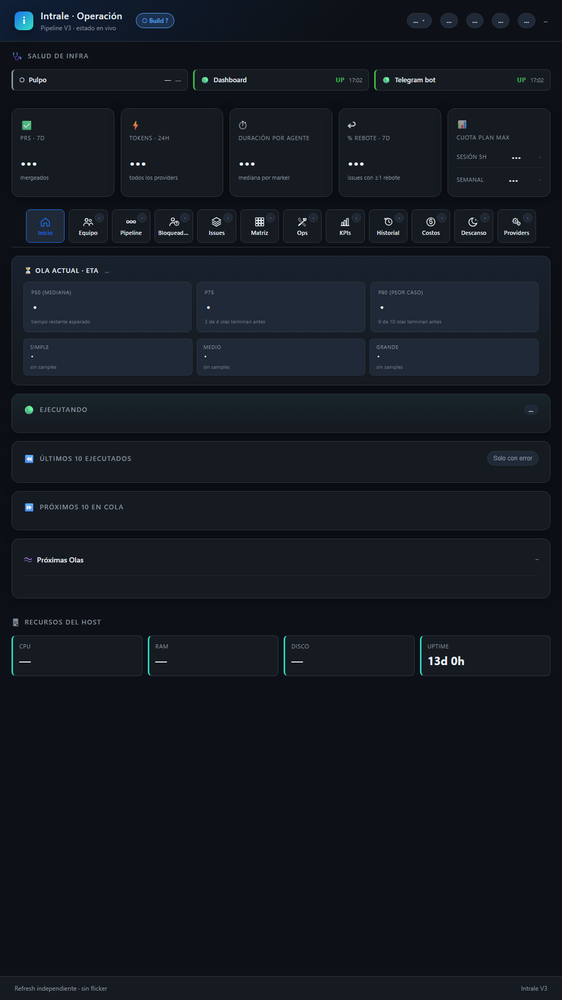</figure>
<figure><figcaption>Pantalla objetivo — Mission Control de 3 bandas (mockup)</figcaption>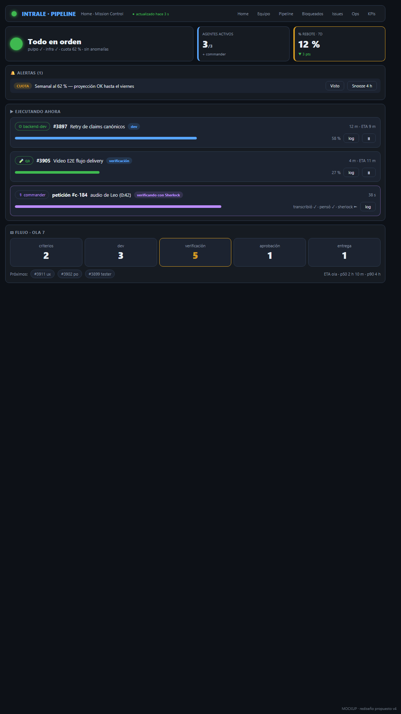</figure>
</div>

### 5.2 Equipo (`/equipo`)

**Actual:** grid de cards por skill con carga agregada `N/MAX`, barra de utilización y botón ✕ que mata TODOS los agentes del skill sin confirmar. Sin detalle de agentes individuales, sin historial.

**Rediseño:** cada card de skill se expande en acordeón mostrando sus agentes vivos (issue, fase, progreso %, duración, log) y un sparkline de carga de las últimas 24 h. El ✕ pasa a menú contextual por agente individual con modal de confirmación que muestra qué se va a matar (issue, fase, tiempo invertido). El Commander aparece como skill especial no cancelable con su petición en curso.

**Descripción funcional:** datos de `/api/dash/active` ya disponibles — es render, no backend nuevo. El acordeón persiste su estado en sessionStorage. La capacidad `max` por skill se muestra con link a la config (solo lectura en el dashboard). Si un agente está en cooldown por fast-fail, la card lo muestra con cuenta regresiva. Accesible por teclado (cards focusables, Enter expande).

<figure><figcaption>Pantalla actual — Equipo (captura en vivo)</figcaption>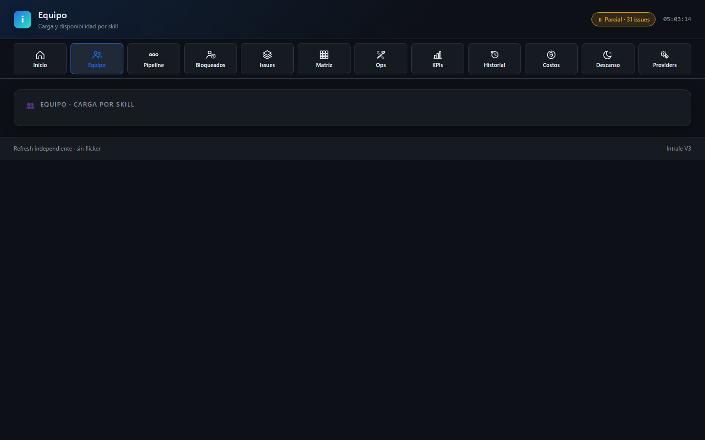</figure>
<figure><figcaption>Pantalla objetivo — acordeón por skill con agentes individuales (mockup)</figcaption>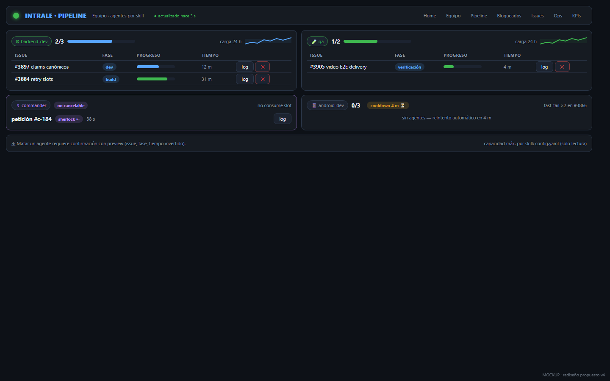</figure>

### 5.3 Pipeline / Kanban (`/pipeline`)

**Actual:** columnas dinámicas por (pipeline, fase) con cards de issue, pills de agentes diminutas (10 px), badges de rebote/stale, botones de reorden y pausa, toggle de allowlist, wave band inferior. Problemas: pills ilegibles en kiosk, sin breakdown inline, scroll horizontal sin indicador, dos conceptos de "pausa" confundibles.

**Rediseño:** kanban con zoom semántico de 3 niveles: **vista lejos** (kiosk: solo conteos y semáforos por columna, tipografía grande), **vista normal** (cards como hoy pero pills ≥14 px con barra de micro-progreso y popover al hover con todo el detalle del agente), **vista foco** (una columna expandida con timeline de cada issue). Indicadores de overflow horizontal (sombra + flecha "+3 fases"). Unificar la semántica de pausa: un solo badge con estados `pausado` / `fuera de allowlist` claramente etiquetados.

**Descripción funcional:** el nivel de zoom se elige manual o automáticamente según viewport. El popover del agente muestra issue, skill, fase, estado, edad, motivo del último rebote y botones log/pausar. El reorden manual (⏫▲▼⏬) se conserva con feedback optimista y rollback si el POST falla. La wave band se convierte en una bandeja colapsable "gestionados fuera de flujo" con explicación de por qué cada issue está ahí.

<figure><figcaption>Pantalla actual — Pipeline (captura en vivo)</figcaption>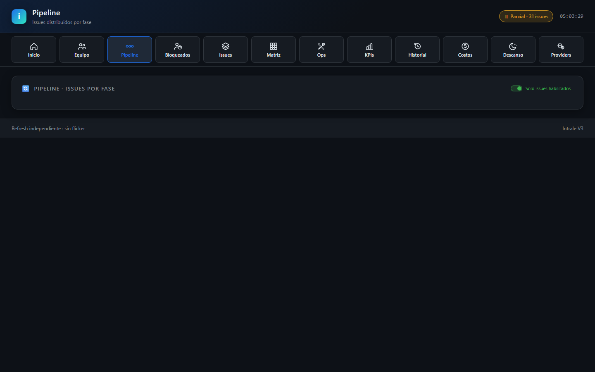</figure>
<figure><figcaption>Pantalla objetivo — kanban con zoom semántico y pills legibles (mockup)</figcaption>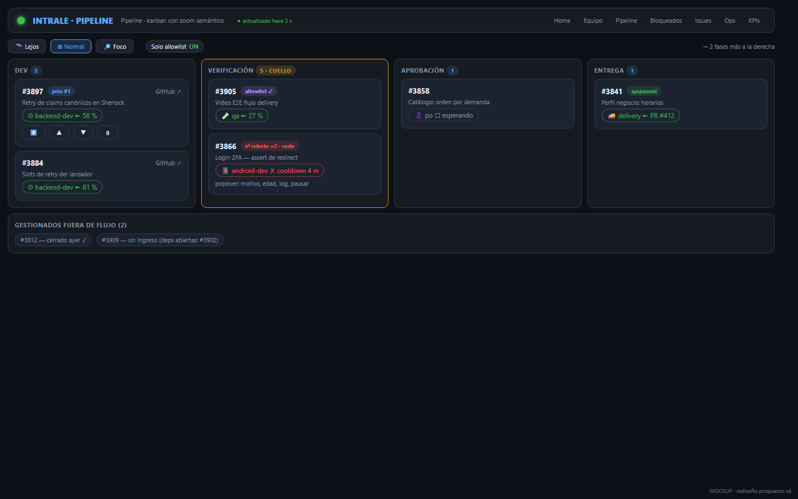</figure>

### 5.4 Bloqueados (`/bloqueados`)

**Actual:** filas con rail de severidad de 3-4 px por color, edad, pregunta/motivo en texto crudo (a veces JSON), eventos recientes, acciones ▶ reactivar / ✕ desestimar sin confirmación. Sin búsqueda ni link a Telegram.

**Rediseño:** triage queue estilo bandeja de incidentes: orden por severidad×edad, cada fila con badge grande de severidad (icono + texto + color), motivo parseado y legible (pretty-print si es JSON), contexto de qué se necesita del humano, y CTA primario explícito ("Responder pregunta", "Aprobar", "Reintentar"). Desestimar exige confirmación con motivo que queda en audit trail. Header con stats: SLA promedio de desbloqueo, resueltos hoy.

**Descripción funcional:** filtro por skill/fase/severidad y búsqueda por texto. Cada fila enlaza al issue de GitHub y, si la pregunta se originó en una conversación de Telegram, al deep-link del mensaje. Al reactivar, el sistema muestra a qué fase/cola vuelve el issue. Empty-state celebratorio con métricas del día.

<figure><figcaption>Pantalla actual — Bloqueados (captura en vivo)</figcaption>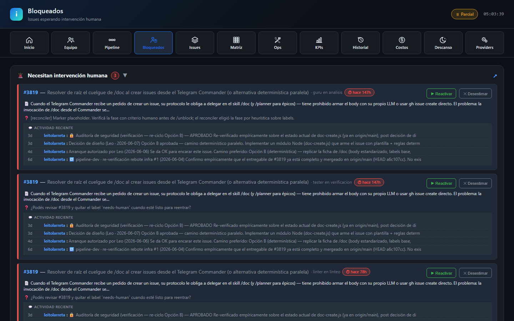</figure>
<figure><figcaption>Pantalla objetivo — triage queue con severidad y CTA explícito (mockup)</figcaption>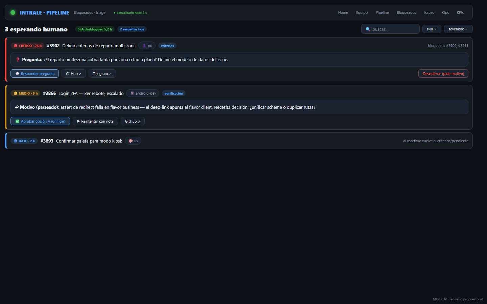</figure>

### 5.5 Issues (`/issues`)

**Actual:** filter chips + búsqueda client-side + grid de cards; modal con timeline de fases y motivo de rechazo en crudo. Filtros no persisten; sin ETA ni indicadores de riesgo.

**Rediseño:** tabla/grid conmutable con columnas configurables (estado, fase, skill activo, rebotes, edad, ETA p50, riesgo), filtros persistidos en URL, y un panel lateral de detalle (en lugar de modal) con timeline visual de fases — segmentos proporcionales al tiempo con color por resultado — historial de rebotes con causas, y acciones (priorizar, pausar, abrir en GitHub).

**Descripción funcional:** el indicador de riesgo se calcula con reglas simples y explicables (rebotes ≥2, edad > p90 de su fase, dependencia abierta). El panel lateral mantiene la lista visible (no se pierde contexto al inspeccionar). La búsqueda incluye número, título y labels. Exportación CSV del listado filtrado.

<figure><figcaption>Pantalla actual — Issues (captura en vivo)</figcaption>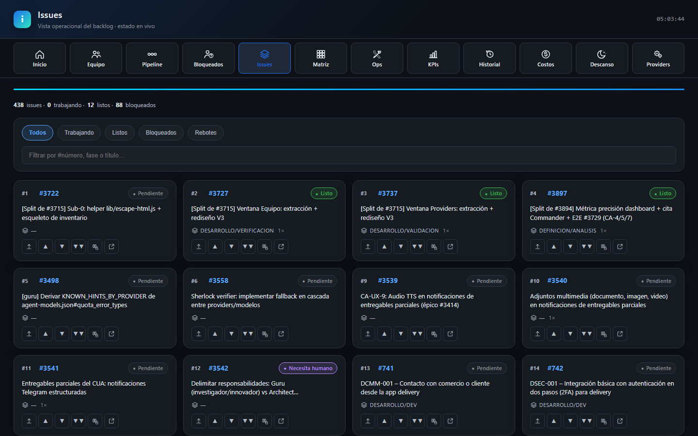</figure>
<figure><figcaption>Pantalla objetivo — tabla configurable + panel lateral con timeline (mockup)</figcaption>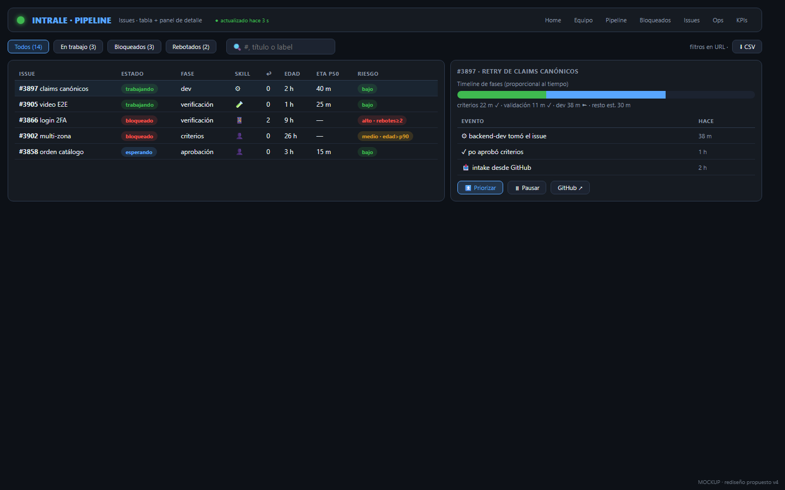</figure>

### 5.6 Matriz (`/matriz`)

**Actual:** heat-map skill × fase con conteos y 3 niveles de color; sin drill-down (el click no hace nada), leyenda solo en tooltip, contraste insuficiente.

**Rediseño:** heat-map interactivo: click en celda abre el listado de issues de esa (skill, fase) en panel lateral; en cada celda, junto al conteo, una flecha de tendencia (▲▼ vs. hace 24 h); paleta accesible con patrón además de color; leyenda fija visible.

**Descripción funcional:** la tendencia se calcula de snapshots horarios ya persistidos en metrics-history. Detección de cuello de botella: la celda con mayor (conteo × edad media) se marca con borde pulsante y un texto "cuello de botella probable". El orden de skills se sincroniza con el de Pipeline/Equipo.

<figure><figcaption>Pantalla actual — Matriz (captura en vivo)</figcaption>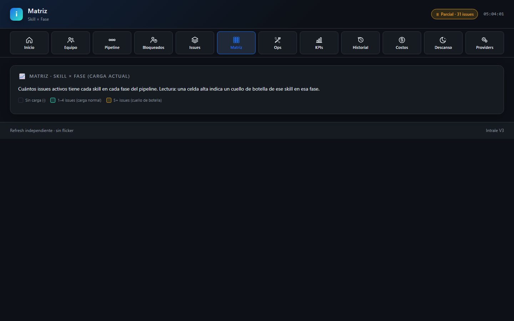</figure>
<figure><figcaption>Pantalla objetivo — heat-map interactivo con tendencias y drill-down (mockup)</figcaption>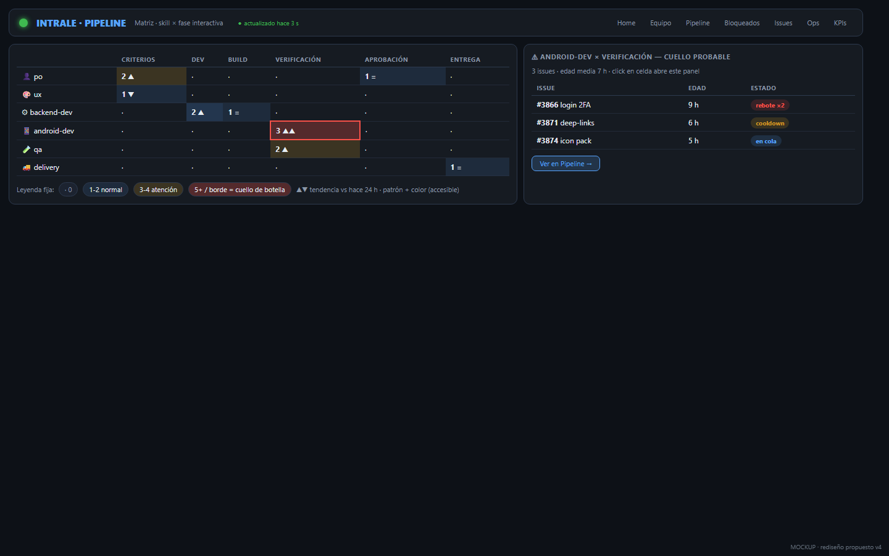</figure>

### 5.7 Ops (`/ops`)

**Actual:** banner rojo si Telegram caído, 5 cards de procesos (PID, vivo/muerto, uptime), conteo de stale-orders del reconciler con tabla por motivo, 4 mini-cards de QA env. Logs en otra ventana; sin historial de reinicios; sin causa del outage.

**Rediseño:** centro de operaciones con: topología visual de servicios (pulpo → listener → servicios → dashboard) donde cada nodo muestra salud y al click despliega panel con últimas líneas de log inline (SSE), historial de reinicios/caídas y botón de restart con confirmación; el reconciler con gráfico de torta por motivo y serie temporal; el banner de Telegram reemplazado por el nodo en rojo + entrada en la bandeja de alertas con "desde cuándo" y último error completo.

**Descripción funcional:** cada nodo persiste su historial de transiciones vivo↔muerto (timestamp + causa si se conoce). El log inline es de solo lectura con follow automático y pausa al hacer scroll. El restart por nodo invoca el mecanismo existente de `restart.js` acotado al servicio, con audit de quién lo pidió.

<figure><figcaption>Pantalla actual — Ops (captura en vivo)</figcaption>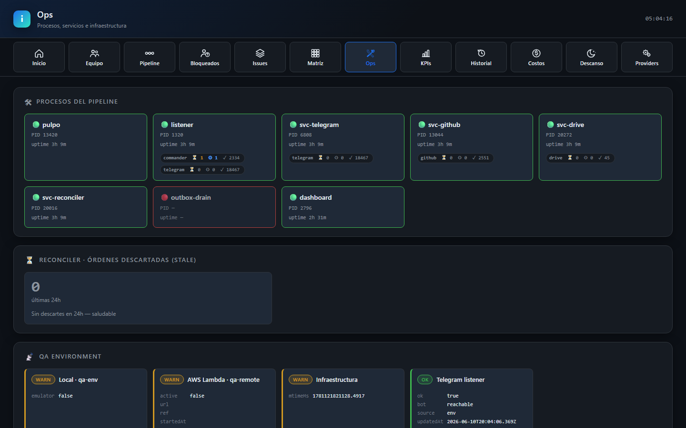</figure>
<figure><figcaption>Pantalla objetivo — topología de servicios con log inline (mockup)</figcaption>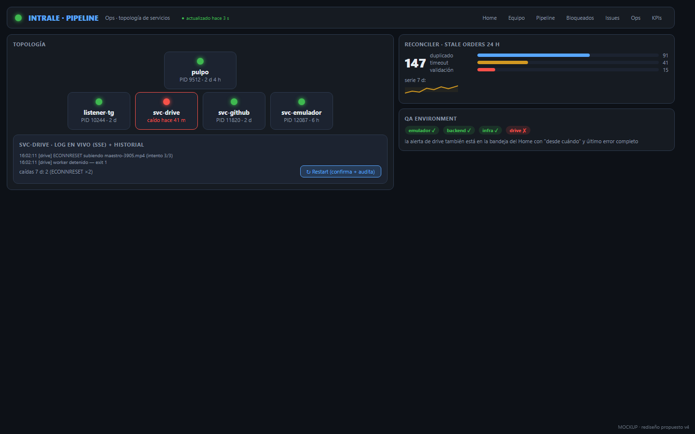</figure>

### 5.8 KPIs (`/kpis`)

**Actual:** grilla de KPI cards con delta %, métricas DORA + ruteo del Commander (determinístico vs. LLM), tablas de performance por agente, cobertura multi-provider. Sin contexto histórico ni explicaciones; sin drill-down.

**Rediseño:** cada KPI con sparkline de 7/30 días y banda de "rango normal"; tooltip "cómo se calcula" en cada métrica; sección DORA con los 4 indicadores clásicos y su tendencia; tabla de agentes con filtros y orden; cobertura multi-provider con drill-down a los despachos del día por proveedor.

**Descripción funcional:** los datos históricos salen de metrics-history.jsonl y los snapshots existentes (sin instrumentación nueva). Umbrales configurables por KPI: al excederse, el KPI se pinta y genera entrada en la bandeja de alertas. Aquí viven también las métricas nuevas del canal de voz (tasa de rechazo de Sherlock por proveedor, % same-provider, p95 de latencia voz) y de entregables (% de fases con entregable, por skill).

<figure><figcaption>Pantalla actual — KPIs (captura en vivo)</figcaption>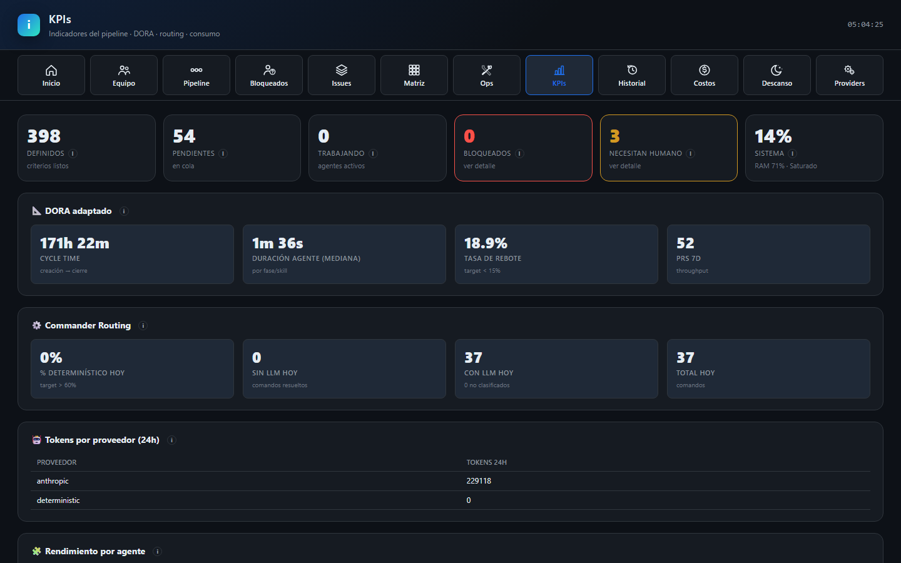</figure>
<figure><figcaption>Pantalla objetivo — KPIs con sparklines, umbrales y métricas de voz/entregables (mockup)</figcaption>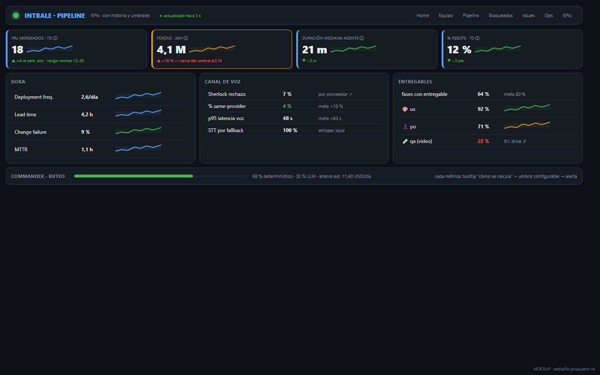</figure>

### 5.9 Costos (`/costos`)

**Actual:** pill + banner persistente de anomalía con top-3 skills y snooze, KPIs de costo, tablas por skill/fase/issue, proyecciones con semáforo, barra LLM vs. determinístico. Tablas con overflow, snooze sin feedback, sin fecha de inicio de anomalía.

**Rediseño:** vista de control de presupuesto: gráfico principal de consumo diario (área apilada por proveedor) con línea de presupuesto, anomalía marcada sobre el gráfico (banda sombreada desde su inicio) en lugar de banner gigante, tablas con columnas esenciales + expandir, proyecciones con explicación del método ("promedio móvil 7d × días restantes"), y confirmación visual del snooze ("silenciada hasta las 18:00").

**Descripción funcional:** el inicio de la anomalía sale del detector existente (`anomaly-detector.js` persiste el timestamp). Drill-down por skill → sesiones individuales con costo y duración. Presupuesto mensual configurable (conecta con la mejora D-3 de presupuesto de tokens).

<figure><figcaption>Pantalla actual — Costos (captura en vivo)</figcaption>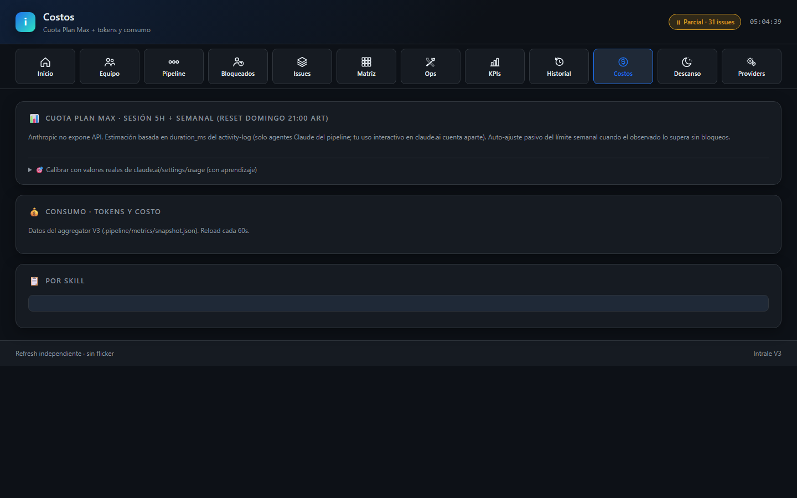</figure>
<figure><figcaption>Pantalla objetivo — consumo con presupuesto y anomalía sobre el gráfico (mockup)</figcaption>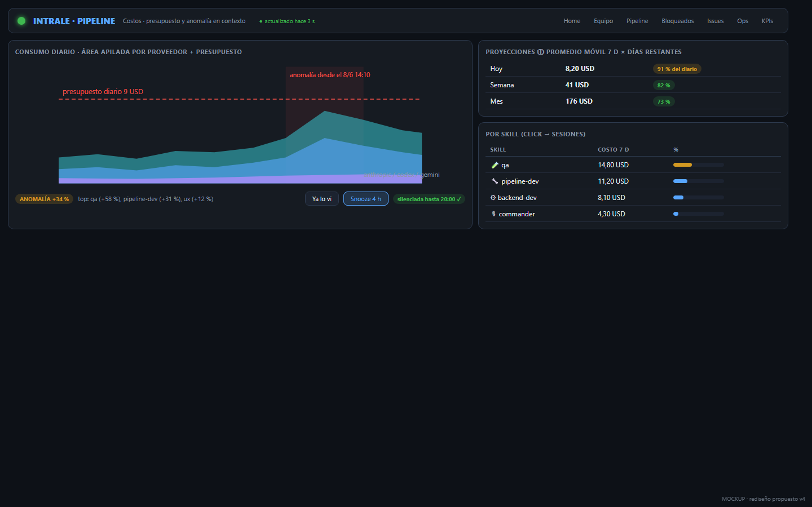</figure>

### 5.10 Historial (`/historial`)

**Actual:** lista plana de hasta 50 ejecuciones con glifo de estado, duración, links a log/PDF; sin búsqueda, sin filtros, sin agregados; timestamps ISO.

**Rediseño:** línea de tiempo agrupada por día con filtros (skill, resultado, issue) y búsqueda; cada entrada expandible inline con el detalle de la ejecución (fases, rebotes, costo, links a log/PR/entregable); header con agregados del período visible (ejecuciones, % aprobado, duración mediana).

**Descripción funcional:** los entregables parciales (sección 4) aparecen aquí adjuntos a cada ejecución — el historial se vuelve el archivo navegable de la solución de cada issue. Paginación por fecha (no "show more" infinito). Exportable.

<figure><figcaption>Pantalla actual — Historial (captura en vivo)</figcaption>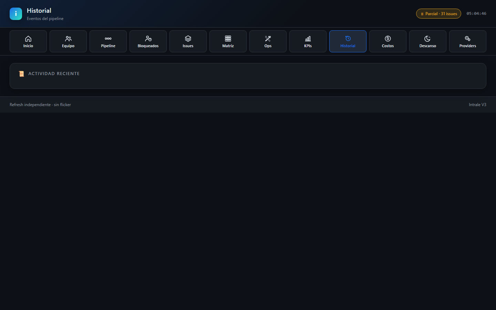</figure>
<figure><figcaption>Pantalla objetivo — timeline por día con entregables adjuntos (mockup)</figcaption>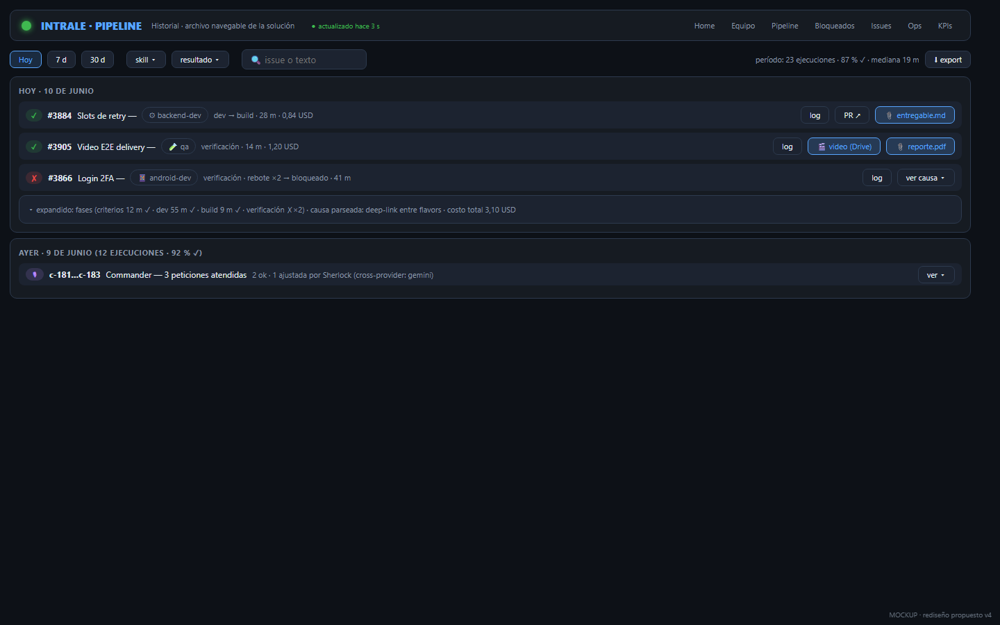</figure>

### 5.11 Descanso (`/descanso`)

**Actual:** checkbox global + grilla semanal de períodos HH:MM con debounce de 3 s, bypass labels de solo lectura; sin preview, guardado opaco, overflow horizontal.

**Rediseño:** timeline visual semanal (7 columnas × 24 h) donde los períodos de descanso se pintan como bloques arrastrables/clickeables; indicador "ahora" en vivo; al guardar, confirmación explícita ("guardado — próximo descanso hoy 22:00"); los bypass como chips con tooltip de por qué ese skill ignora el descanso.

**Descripción funcional:** validación de solapamientos visual e inmediata. Muestra el próximo evento (entrada/salida de descanso) y qué agentes serían pausados si entrara ahora. Cambios auditados (quién, cuándo).

<figure><figcaption>Pantalla actual — Descanso (captura en vivo)</figcaption>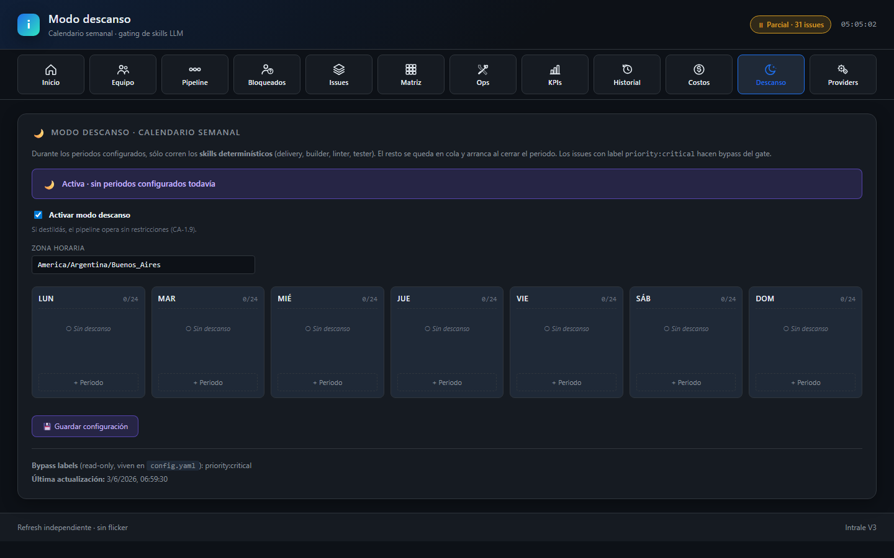</figure>
<figure><figcaption>Pantalla objetivo — timeline semanal visual con bloques editables (mockup)</figcaption>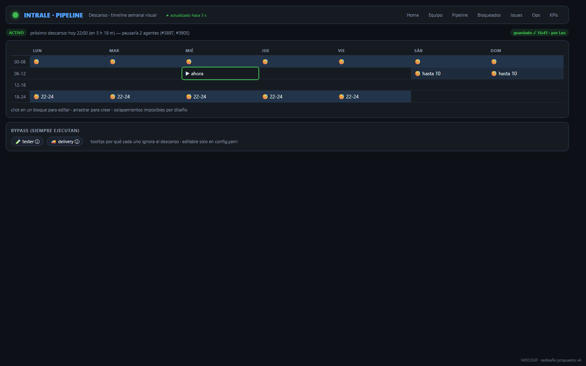</figure>

### 5.12 Multi-provider (pendiente #3727)

**Actual:** no existe como pantalla; hay datos dispersos en KPIs (cobertura, despachos por proveedor).

**Rediseño (pantalla nueva):** estado de cada proveedor (Anthropic, Codex, Gemini, Cerebras, NVIDIA): salud del live-ping, cuota/gates activos, despachos 24 h, latencia p50/p95, tasa de error por clase (incluido `cli_1m_context_glitch`), y qué skills lo tienen como primario/fallback. Para Sherlock: % de verificaciones cross-provider vs. same-provider (vigilancia de I-V4).

**Descripción funcional:** matriz proveedor × skill desde `agent-models.json` (fuente de verdad, solo lectura). Timeline de eventos de gate/exhaustion/recovery. Acción manual "probar proveedor ahora" que dispara el live-ping puntual.

<figure><figcaption>Pantalla actual — no existe (datos dispersos en KPIs)</figcaption></figure>
<figure><figcaption>Pantalla objetivo — Multi-provider: salud, ruteo y % cross-provider de Sherlock (mockup)</figcaption>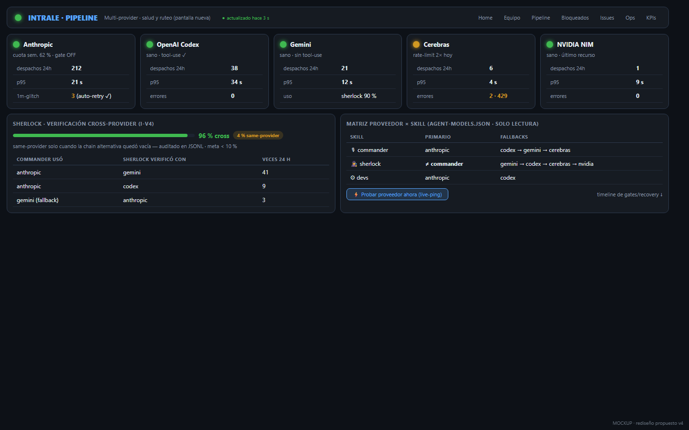</figure>

---

## 6. Mejoras IMPRESCINDIBLES

Riesgos que pueden detener la operación, corromper estado o comprometer seguridad. Atacar primero. **Las cuatro primeras son del canal de voz** — el flujo que más usás y donde pediste foco.

### I-V1. Formalizar el stack multimedia 100 % gratuito (decisión adoptada)
Dejar de tratar OpenAI/ElevenLabs como primarios caídos y convertir el stack gratuito en el oficial: **STT → faster-whisper con `large-v3-turbo` int8 como motor primario** (mejor calidad que la API que se reemplaza, ~1,5-2 GB de RAM, cambio acotado a `lib/whisper-local.js`); **TTS → Edge TTS como motor definitivo**. Retirar OpenAI de la cadena STT/TTS y deprecar ElevenLabs en config y credenciales (hoy cada llamada al primario muerto agrega latencia y ruido de errores antes de caer al fallback). Mantener la arquitectura de fallback por si se agrega otro motor gratuito después.

### I-V2. Eco de transcripción en cada audio
Mostrar siempre "🎤 *Entendí: «…»*" (como cita colapsada o pie de la respuesta). Es la única defensa real contra errores de STT: ni el Commander ni Sherlock pueden detectar una transcripción equivocada (S-4). Costo de implementación bajísimo (el texto ya existe en `_textoFinal`), impacto directo en tu confianza en el canal.

### I-V3. Memoria conversacional estructurada para ideación
Reemplazar el contexto de sesión de 30 min + historial plano por una conversación con roles (user/assistant) persistida por chat, con resumen incremental cuando crece (p. ej. cada 20 turnos se compacta lo viejo a un resumen). Es el cambio de mayor impacto en la calidad de las respuestas durante sesiones largas de ideación. Aprovechar `commander-history.jsonl` existente como fuente.

### I-V4. Devolver adversarialidad real a Sherlock (decisión adoptada, premisa refinada)
**Premisa formal: Sherlock usa un proveedor diferente al que usó el Telegram Commander para esa respuesta, salvo que no tenga otro disponible.** Implementación: re-priorizar la cascada de la chain `telegram-sherlock` excluyendo el provider efectivo del Commander (la información ya se calcula — `sameProvider`, sherlock-verifier.js:1557); si la chain queda vacía (todos gateados o caídos), se admite same-provider como último recurso y el disclaimer lo refleja ("verificado con el mismo proveedor"). Auditar en el JSONL cuántas verificaciones terminan same-provider para vigilar que sea la excepción y no la regla. Complemento: pasarle a Sherlock el contexto de conversación (S-3), no solo la pregunta puntual.

### I-V5. Eliminar el falso error "Usage credits required for 1M context"
El bug está identificado (#3506: el CLI de Claude Code devuelve "Usage credits required for 1M context" aunque el plan Max 20x sí lo cubre) y el pipeline ya lo **detecta y clasifica** correctamente como `cli_1m_context_glitch` sin marcar cuota agotada. Pero el workaround actual se queda corto: registra el hit, te manda un mensaje "🐞 …Reintentá tu pedido en unos segundos" **y descarta tu petición** (pulpo.js:8692-8727). Es decir: el sistema sabe que es un glitch transitorio y aun así te traslada el reintento a vos. **Acción:** al detectar el glitch, reintentar automáticamente el mismo spawn (1-2 reintentos con backoff corto); si reincide, relanzar esa respuesta con contexto estándar (`--model` sin sufijo `[1m]`) de forma transparente, anotando en el log qué contexto se usó. El usuario no debe ver nunca más ese mensaje salvo agotados todos los reintentos. Mantener el contador TTL existente para detectar si el bug del CLI se volvió persistente y conviene reportarlo a Anthropic.

### I-M1. Cerrar el circuito de entregables parciales (videos → Drive + whitelist)
Es el desbloqueo mínimo para que la feature prioritaria de la sección 4 empiece a funcionar: (1) conectar el encolado a `servicios/drive/pendiente/` para videos que excedan los límites de Telegram y enviar el link en el mensaje; (2) notificar el fallo cuando un adjunto no pueda enviarse (hoy muere en silencio); (3) ampliar `DEFAULT_NOTIFY_SKILLS` a todos los skills con entregable definido. El detalle completo y el resto de las brechas quedan en la épica EP-3 (sección 10).

### I-1. Cobertura de tests para los brazos críticos del Pulpo

### I-1. Cobertura de tests para los brazos críticos del Pulpo
`pulpo.js` concentra toda la lógica de orquestación (~12K líneas) y **no tiene tests unitarios** para `brazoBarrido`, `brazoLanzamiento` ni `brazoDesbloqueo` (solo 10 de 42 scripts de `.pipeline/` tienen test). Cualquier cambio en clasificación de rebotes o promoción de fases puede romper el pipeline completo sin detección. **Acción:** extraer la lógica pura de cada brazo (clasificadores, máquinas de estado, parseo de YAML) a módulos testeables y cubrir los caminos de rebote/escalada/promoción.

### I-2. Eliminar condiciones de carrera TOCTOU en el loop principal
- `reencolarInfraBloqueados` (pulpo.js ~línea 638) escanea `pendiente/` sin lock: otro brazo puede mover el archivo entre lectura y escritura.
- `countActiveAgents` vs. spawn (~línea 4700): dos evaluaciones cercanas pueden superar el máximo de 3 agentes.
**Acción:** patrón claim-by-rename (renombrar el archivo a un nombre de propiedad exclusiva *antes* de operar) y contador con reserva atómica antes del spawn.

### I-3. Auto-resume del circuit breaker de infra
Si el breaker se abre y nadie ejecuta `resume.js`, el pipeline queda muerto **indefinidamente**. El precheck ya detecta la transición fail→ok; falta cerrar el breaker automáticamente tras N prechecks consecutivos OK (con notificación Telegram), manteniendo el cierre manual como override.

### I-4. Manejo de errores fail-fast en estados corruptos
`uncaughtException`/`unhandledRejection` se loguean pero el loop continúa (pulpo.js ~líneas 233-242), y el catch genérico del mainLoop traga excepciones de brazos críticos. Un YAML corrupto puede propagarse silenciosamente. **Acción:** clasificar excepciones (infra transitoria → continuar; corrupción de estado → pausar pipeline + alerta), y validar `config.yaml` y los YAML de issue contra schema al cargarlos (hoy `yaml.load()` sin validación).

### I-5. Higiene de credenciales Telegram
El bot token vive en texto plano en `~/.claude/secrets/credentials.json` y fue legible por procesos del pipeline; además existen restos legacy y 3 implementaciones que lo cargan distinto. **Acción:** rotar el bot token ahora (BotFather), aplicar ACL restrictiva al archivo (solo Administrator), y verificar que el cron de rotación (T-14…T-0) esté efectivamente notificando. Nunca volcar el archivo en logs ni informes.

### I-6. Limpieza automática de worktrees y del workspace
Hay **48 worktrees (~17 GB)** en `C:\Workspaces\Intrale`, de los cuales ~12-15 están muertos (ramas inexistentes, >30 días sin tocar, directorios vacíos) — ~8 GB recuperables. El cleanup post-entrega del diseño V2 sigue sin implementarse. Además, la raíz del repo acumula basura: `Ctemp_issues.json`, `bash.exe.stackdump`, `hs_err_pid15268.log`, `gh.zip` + `Workspacesgh.zip` (13 MB duplicados), carpetas fantasma `Workspacesgh-cli/`, `WorkspacesIntraleplatform/`, `UsersAdministratoragent-teams-report.html` (~73 MB en total). **Acción:** integrar la limpieza de worktree al cierre de `/delivery` y un cron de `ghostbusters` que retire worktrees sin rama válida; borrar la basura de raíz y agregar patrones a `.gitignore`.

### I-7. Reactivar (o decidir eliminar) las notificaciones silenciadas
`notify-telegram.js` clasifica urgencias pero **retorna sin enviar** (líneas 163-165: "solo loguear"). El operador cree que recibirá alertas críticas que nunca llegan. **Acción:** reactivar el envío o eliminar el hook y documentar qué canal lo reemplaza; un canal de alertas a medias es peor que ninguno.

---

## 7. Mejoras RECOMENDADAS

Mejoran confiabilidad y mantenibilidad de forma significativa; planificar en las próximas olas. **Las seis primeras son del canal de voz y entregables.**

### R-V6. El Commander como agente visible en el dashboard
Hoy el Commander es invisible mientras trabaja: el dashboard solo muestra un historial estático de `commander-history.jsonl` (últimas 20 líneas, polling 30 s). Si una respuesta tarda 5 minutos (Sherlock, fallbacks), el operador no ve nada. **Acción:** cuando el Commander atiende una petición, publicarlo en `/api/dash/active` como agente en ejecución — con skill `commander`, "issue" = id de la petición, fase = etapa actual (transcribiendo / pensando / verificando con Sherlock / enviando), duración y link a log — reutilizando el mismo esquema de seguimiento de logs que el resto de agentes (`logs/commander-<ts>.log`). **Restricción explícita: no cuenta contra el límite de 3 agentes dev ni toca el control de paralelismo/concurrencia actual**, que funciona bien: es solo presencia observacional (un registro paralelo, no un slot). El skill `commander` no debe ser cancelable desde la card de Equipo.

### R-M1. Doctrina de productores de entregables
Actualizar los SKILL.md de cada agente para que generar el entregable físico (en `.pipeline/assets/{docs,mockups}/{issue}/` o `qa/evidence/{issue}/`) sea **criterio de cierre de fase**, con formato estandarizado por rol (PDF/MD + Mermaid/SVG para diagramas y gráficas). Luego habilitar `audio_enabled` (con Edge TTS) y `cua.enabled`. Sin productores que produzcan, toda la infraestructura de notificación seguirá sin nada que enviar.

### R-V1. Ampliar el árbitro canónico de Sherlock
Hoy solo verifica determinísticamente 3 hechos (S-6). Agregar los claims que más aparecen en tus conversaciones: estado de fase de un issue en el pipeline (leer el YAML directamente), agentes activos, labels `qa:*` de un PR, ola activa. Cada hecho que se mueve del LLM fiscal al árbitro determinístico es un tipo de error que desaparece — es el camino más directo para que "Sherlock se equivoque menos".

### R-V2. Acotar la latencia de Sherlock
Timeout 0 por provider + soft-timeout de 420 s = hasta 7 minutos de espera para terminar en "no pude verificar" (S-7). Poner presupuesto por provider (30-45 s) y un objetivo de p95 < 60 s para el canal de voz; si se excede, enviar la respuesta con disclaimer y completar la verificación en background (editando el mensaje después si Sherlock rechaza).

### R-V3. Subir el presupuesto de evidencia independiente
500 ms totales / 200 ms por fuente en Windows con git/gh fríos produce demasiados `not_verifiable` (S-5). Subir a 2-3 s totales (la latencia ya la domina el LLM) y cachear los resultados de git/gh entre verificaciones cercanas. Medir y graficar la tasa de `not_verifiable` por fuente en el audit JSONL.

### R-V4. Avisos de degradación proactivos
Cuando el dispatch cae a un provider sin tool-use, avisar en ese momento qué NO va a poder hacer (hoy el gate SEC-5 rechaza la creación de issues con respuesta enlatada sin contexto). Cuando el TTS falla y la respuesta sale solo en texto, decirlo. Cuando la verificación fue same-provider, marcarlo en el disclaimer.

### R-V5. Split inteligente de respuestas largas
Reemplazar el truncamiento a 4.000 chars con "..." por división en múltiples mensajes respetando bloques markdown, y agregar el fallback MarkdownV2→HTML también en el camino del listener (hoy solo existe en otra ruta).

### R-1. Modularizar pulpo.js y dashboard.js
22.500 líneas en dos archivos. Separar cada brazo, el commander y el render del dashboard en módulos con interfaces claras. Esto habilita I-1 (tests) y reduce el riesgo de merge conflicts en `pipeline-dev`.

### R-2. Unificar el cliente Telegram
Tres implementaciones paralelas (`telegram-client.js`, `commander/telegram-api.js`, envío propio en `notify-telegram.js`) con timeouts distintos (5 s/8 s/15 s/30 s) y retry inconsistente. Consolidar en una sola librería con retry, circuit breaker (existe `circuit-breaker.js` pero no está integrado) y límite de cola en `servicios/commander/pendiente/` (hoy sin tope).

### R-3. Resolver las ambigüedades del proceso en `agents/`
Contradicciones detectadas entre módulos: definición de **Ready** (¿PR creado vs. QA aprobado? — 00 vs. 15 vs. 16), timing de **In Progress** (¿al tomar la tarea o al crear PR? — 01/02 vs. 16), destino del refinamiento (¿Refined o Todo? — 12 vs. 04), quién aplica los labels `qa:*`, y la relación Blocked vs. veredicto `INFRA_ERROR` de la doctrina QA. Definir cada punto en una sola fuente y referenciarla; agregar módulo de **desbloqueo** (quién y cómo saca un issue de Blocked).

### R-4. Consolidar la documentación V1/V2/V3
`informe-migracion-v1-v2.md` (2026-03-28) describe gaps que el código actual ya cerró (p. ej. el commander determinístico existe en `lib/commander-deterministic.js`), mientras otros docs referencian componentes eliminados (`tg-session-store.json`, provider Groq, dashboard de terminal). Crear un único `docs/pipeline-estado-actual.md` (diseñado vs. implementado vs. operativo) y archivar lo histórico en `_archived/`.

### R-5. Eliminar rutas hardcodeadas
`C:\Workspaces\gh-cli\bin\gh.exe` y `/c/Workspaces/...` aparecen en 7+ scripts (`sprint-report.js`, `cli-ops.js`, `qa-env-up-remote.sh`, `delivery-all.sh`, hooks varios) y en el propio pulpo. Centralizar en `config.yaml`/variables de entorno con resolución por `resolveMainRepoRoot()`.

### R-6. Distinguir timeout de crash en la muerte prematura
El umbral de 15 s detecta crashes de infra, pero un agente que muere por timeout del provider (>60 s) no se clasifica, contaminando cooldowns. Registrar exit code + duración + última línea de log para clasificar (crash / timeout / quota / OOM) y alimentar `agent-doctor.js`.

### R-7. Externalizar magic numbers a config.yaml
Cooldowns (5/60 min), `MAX_EST_MEM = 5 %`, umbral de deadlock, intervalo de dedup de alertas (60 s — genera hasta 60 alertas/hora en bucle de error). Documentar la justificación del gate predictivo.

### R-8. Política de retención de evidencia QA
`qa/evidence/` acumula videos y screenshots por issue (~1-2 GB/sprint) **commiteados al repo**, lo que infla el clone para siempre. Migrar a Git LFS o a almacenamiento externo (el upload a Drive ya existe en `qa-video-share.js`) dejando en el repo solo el `qa-results.json` y links.

### R-9. Rotación y compresión de logs de actividad
`activity-log.jsonl` y `metrics-history.jsonl` crecen sin límite (la rotación actual solo cubre `hook-debug.log`). Rotación diaria + gzip + retención de 30 días.

### R-10. Validación de arranque más estricta
`pre-launch-validation.js` debería validar al boot: credenciales Telegram cargables, `gh` accesible, schema de `config.yaml`, espacio en disco (>20 GB dado el peso de worktrees/emuladores). Hoy varios de estos fallan recién en runtime.

---

## 8. Mejoras DESEADAS

Aumentan madurez del modelo; valen la pena cuando lo anterior esté encaminado.

| # | Mejora | Detalle |
|---|---|---|
| D-1 | **SLAs formales** | Hoy hay métricas (lead time, throughput, ETA p50/p90) pero ningún SLA: tiempo máximo por estado, tasa de rebote aceptable, disponibilidad del pipeline. Definirlos y alertar al violarlos. |
| D-2 | **Retrospectiva automática de rebotes** | Agente periódico que analice `motivo_rechazo` de la semana, agrupe causas raíz y proponga issues de mejora (cierra el loop de mejora continua que la doctrina promete). |
| D-3 | **Presupuesto de tokens por issue/ola** | El tracking existe; falta presupuesto: límite estimado por story point con alerta al excederlo, integrado al gate de lanzamiento. |
| D-4 | **Dashboard DORA real** | Deployment frequency, lead time, change failure rate y MTTR calculados desde los datos que ya se persisten. |
| D-5 | **Portabilidad multi-OS** | Los workarounds de Windows (`process.kill(pid,0)`, `tasklist` CSV, `spawn` sin timeout) encapsulados en una capa `platform-utils`, habilitando un futuro runner Linux (más barato para CI/agentes). |
| D-6 | **Pool de emuladores persistente** | El snapshot "qa-ready" ya baja el boot a ~40 s; un emulador caliente compartido entre QA consecutivos eliminaría ese costo por corrida. |
| D-7 | **Limpieza de scripts legacy** | `patch-dashboard-1765*.js` (3 variantes), `test-1765-features.js`, `sprint-pids.json`, `roadmap.backup.json`, skills congelados (`desktop-dev`, `_frozen/scrum`): marcar DEPRECATED o borrar. |
| D-8 | **Caché de configuración en hooks** | `getConfig()` relee el JSON de credenciales en cada mensaje; añadir caché con TTL 30 s. Menor, pero gratis. |

---

## 9. Plan de ataque sugerido

1. **Hoy (quick wins, <1 h):** retirar OpenAI/ElevenLabs de la cadena multimedia y dejar el stack gratuito como oficial (I-V1, primera parte), borrar basura de raíz (I-6 parcial), rotar token Telegram (I-5), decidir destino de `notify-telegram.js` (I-7).
2. **Esta semana (focos voz + entregables):** migrar whisper-local a faster-whisper `large-v3-turbo` (I-V1, segunda parte), eco de transcripción (I-V2 — bajo costo, máximo impacto en confianza), re-priorizar la chain de Sherlock cross-provider (I-V4), auto-retry del glitch "1M context" (I-V5 — EP7-H3), conectar videos→Drive + ampliar whitelist de entregables (I-M1), auto-resume del circuit breaker (I-3), limpieza de worktrees (I-6).
3. **Próximas 2-3 olas:** Commander visible en dashboard (R-V6 — EP7-H1/H2), fundamentos del rediseño del dashboard (EP8-H0) y Home Kiosk (EP8-H1), doctrina de productores + encendido de audio/CUA (R-M1), memoria conversacional estructurada (I-V3), árbitro canónico ampliado (R-V1) y presupuesto de evidencia (R-V3), latencia de Sherlock (R-V2), claim-by-rename TOCTOU (I-2), schema de config + fail-fast (I-4), primeros tests de brazos (I-1) con la modularización (R-1). Luego el resto de EP-8 pantalla por pantalla, priorizando Pipeline y Bloqueados (las de mayor uso operativo).
4. **Continuo:** avisos de degradación (R-V4), split de respuestas (R-V5), unificación Telegram (R-2), reglas `agents/` (R-3), doc de estado actual (R-4), retención de evidencia QA (R-8), rotación de logs (R-9); luego SLAs (D-1) y retrospectiva de rebotes (D-2).

### Métrica de éxito para el canal de voz
Definir y graficar en el dashboard: tasa de rechazo de Sherlock por proveedor (los campos `sameProvider`/`sameModel` ya se auditan), tasa de `not_verifiable` por fuente de evidencia, p95 de latencia pregunta→respuesta por voz, y % de audios transcriptos correctamente (medible vía eco de transcripción + correcciones del usuario). Para entregables: % de fases cerradas con entregable adjunto, por skill.

---

## 10. Épicas propuestas — backlog para crear en GitHub

Listas para cargar con `/historia` o el intake YAML (módulo 20). Cada épica con sus historias hijas y criterio de cierre. Orden = prioridad sugerida.

### EP-1 — Canal de voz 100 % gratuito y confiable
**Objetivo:** que la cadena audio→texto→respuesta→voz funcione con motores gratuitos, sin errores silenciosos de transcripción.
**Labels sugeridos:** `area:pipeline`, `tipo:infra`, `epic`

| Historia | Resumen | AC clave |
|---|---|---|
| EP1-H1 | Migrar `lib/whisper-local.js` a faster-whisper `large-v3-turbo` int8 | Transcripción es-AR en <30 s para audios de 1 min; RAM pico <2,5 GB; tests con audios de referencia |
| EP1-H2 | Promover STT local a primario y retirar OpenAI/ElevenLabs de la cadena multimedia | Ninguna llamada a APIs pagas en STT/TTS; config y credenciales limpias; Edge TTS documentado como motor oficial |
| EP1-H3 | Eco de transcripción en cada audio | Toda respuesta a un audio incluye "🎤 Entendí: «…»"; si la confianza es baja, pide confirmación antes de actuar |
| EP1-H4 | Aviso de degradación multimedia | Si el STT/TTS activo falla, el usuario recibe un mensaje claro con el motivo y el modo en que se respondió |

### EP-2 — Sherlock cross-provider y más determinístico
**Objetivo:** que el verificador no comparta el sesgo del generador y verifique más con hechos y menos con LLM.
**Labels:** `area:pipeline`, `tipo:infra`, `epic`

| Historia | Resumen | AC clave |
|---|---|---|
| EP2-H1 | Re-priorizar chain `telegram-sherlock`: provider **siempre distinto** al usado por el Commander, salvo que no exista otro disponible | `sameProvider=true` solo cuando la chain alternativa está agotada; disclaimer lo indica; % same-provider auditado y visible en dashboard |
| EP2-H2 | Pasar contexto conversacional a Sherlock | El prompt fiscal incluye los últimos N turnos estructurados, no solo la pregunta puntual |
| EP2-H3 | Ampliar árbitro canónico (fase del issue en pipeline, agentes activos, labels qa:*, ola activa) | ≥7 claims determinísticos; tasa de `not_verifiable` por fuente graficada |
| EP2-H4 | Presupuesto de evidencia 2-3 s con caché git/gh | Tasa de `not_verifiable` baja ≥50 %; verificación p95 <60 s |
| EP2-H5 | Latencia acotada: presupuesto por provider (30-45 s) + verificación en background con edición posterior del mensaje | Nunca más de 90 s de espera percibida en el chat |

### EP-3 — Entregables parciales multimedia end-to-end (Fase 2)
**Objetivo:** cada agente produce, envía y archiva su entregable parcial al cerrar fase. Cierra las brechas B1-B10 del relevamiento #3891.
**Labels:** `area:pipeline`, `epic`

| Historia | Resumen | AC clave |
|---|---|---|
| EP3-H1 | Conectar videos→Drive (B1/B2) | Video >límite Telegram se encola a `servicios/drive/pendiente/`, el mensaje lleva link compartible; fallo de envío SIEMPRE notifica |
| EP3-H2 | Perfiles de recolección + whitelist para qa, tester, security, builder, architect, devs (B3-B8) | `collectAttachmentsForSkill()` devuelve adjuntos para los 6 skills; whitelist ampliada en config |
| EP3-H3 | Doctrina de productores (B10): cada SKILL.md exige el artefacto físico como criterio de cierre | PO/guru/planner generan PDF/MD con diagramas Mermaid/SVG; UX deja mockups; tester genera reporte (HTML→PDF) |
| EP3-H4 | Habilitar audio TTS del entregable con Edge (#3539) y CUA (#3541) | `audio_enabled: true` y `cua.enabled: true` operando una semana sin incidencias |
| EP3-H5 | Resolver inconsistencias de roots y formatos (B9 + HTML del tester) | Ningún root huérfano en config; formatos por skill alineados a lo que realmente producen |
| EP3-H6 | Métrica: % de fases cerradas con entregable, por skill, en el dashboard | Panel visible; meta inicial ≥80 % en skills con entregable definido |

### EP-4 — Memoria conversacional del Commander
**Objetivo:** sostener sesiones largas de ideación sin perder el hilo.
**Labels:** `area:pipeline`, `tipo:infra`, `epic`

| Historia | Resumen | AC clave |
|---|---|---|
| EP4-H1 | Conversación estructurada user/assistant persistida por chat | Sobrevive reinicios del pulpo; reemplaza el contexto de sesión de 30 min |
| EP4-H2 | Resumen incremental (compactar turnos viejos) | Sesiones de >50 turnos mantienen coherencia; tamaño del prompt acotado |
| EP4-H3 | Contexto de proyecto en el prompt (branches, issues abiertos, estado de builds) | El Commander deja de alucinar estado del repo; fuentes determinísticas, no LLM |

### EP-5 — Robustez del Pulpo
**Objetivo:** que el orquestador sea testeable y no tenga modos de fallo silenciosos.
**Labels:** `area:pipeline`, `tipo:infra`, `epic`

| Historia | Resumen | AC clave |
|---|---|---|
| EP5-H1 | Tests unitarios de brazoBarrido/brazoLanzamiento/brazoDesbloqueo (extraer lógica pura) | Caminos de rebote/escalada/promoción cubiertos |
| EP5-H2 | Claim-by-rename en reencolarInfraBloqueados y reserva atómica de slots de agente | Sin TOCTOU reproducible bajo carrera simulada |
| EP5-H3 | Auto-resume del circuit breaker tras N prechecks OK | Pipeline nunca queda muerto sin intervención; notificación Telegram al reabrir |
| EP5-H4 | Schema de config.yaml + YAML de issue, y fail-fast ante corrupción de estado | Typos en config detectados al boot; excepción de corrupción pausa + alerta |

### EP-6 — Higiene del workspace y gobernanza documental
**Objetivo:** recuperar disco, eliminar ambigüedades de proceso y una sola fuente de verdad.
**Labels:** `area:infra`, `docs`, `epic`

| Historia | Resumen | AC clave |
|---|---|---|
| EP6-H1 | Limpieza automática de worktrees post-delivery + cron ghostbusters | ≤10 worktrees vivos; ~8 GB recuperados; basura de raíz eliminada + .gitignore |
| EP6-H2 | Resolver ambigüedades de reglas (`Ready`, `In Progress`, labels qa:*, desbloqueo de Blocked) | Una sola definición por concepto, módulos `agents/` corregidos + módulo 22-unblocking |
| EP6-H3 | Documento único `pipeline-estado-actual.md` y archivado de docs V1/V2 obsoletos | Cero referencias activas a componentes eliminados |
| EP6-H4 | Evidencia QA fuera de git (LFS o Drive) + rotación de logs JSONL | El clone deja de crecer ~1-2 GB/sprint; logs con retención 30 días |

### EP-7 — Commander observable y sin errores espurios
**Objetivo:** que el operador vea al Commander trabajar como a cualquier agente, y que los glitches del CLI nunca lleguen al usuario.
**Labels:** `area:pipeline`, `tipo:infra`, `epic`

| Historia | Resumen | AC clave |
|---|---|---|
| EP7-H1 | Commander como agente en ejecución en el dashboard | Aparece en `/api/dash/active` con fase (transcribiendo/pensando/verificando/enviando), duración y link a log mientras atiende; desaparece al terminar; **no consume slot del límite de 3 agentes ni altera el control de concurrencia actual**; no cancelable desde Equipo |
| EP7-H2 | Logs del Commander con el mismo esquema que el resto de agentes | `logs/commander-<id>.log` por petición, sanitizado, accesible desde la card del dashboard y el viewer de logs |
| EP7-H3 | Auto-retry del glitch "1M context" (#3506) | Al detectar `cli_1m_context_glitch`: 1-2 reintentos automáticos con backoff; si reincide, relanzar con contexto estándar (`--model` sin `[1m]`) de forma transparente; el usuario no ve el error salvo agotados los reintentos; contador TTL se mantiene |
| EP7-H4 | Clasificación de salida del Commander en el dashboard | Cada petición atendida queda en Historial con resultado (ok/ajustada-por-Sherlock/fallback/error) y proveedor usado |

### EP-8 — Rediseño integral del dashboard (UX del operador)
**Objetivo:** implementar el rediseño de la sección 5: jerarquía de 3 niveles, confianza en el dato, drill-down universal y sistema de diseño único. Una historia por pantalla + una de fundamentos.
**Labels:** `area:pipeline`, `ux`, `epic`

| Historia | Resumen | AC clave |
|---|---|---|
| EP8-H0 | Fundamentos: sistema de diseño (tokens, sprite, componentes `kpi-card`/`agent-pill`/`status-badge`), indicador de frescura + banner de polling fallido, timestamps humanos, framework de confirmaciones y empty-states | Componentes reutilizados por ≥3 pantallas; ningún fetch falla en silencio |
| EP8-H1 | Home Kiosk → mission control de 3 bandas (semáforo global + bandeja de alertas / agentes ahora / flujo de la ola) | Sin scroll en 1080×1920; semáforo con reglas explicables; banners reemplazados por bandeja con ack/snooze auditado |
| EP8-H2 | Equipo → acordeón por skill con agentes individuales, sparkline 24 h y kill por agente con confirmación | Detalle por agente inline; Commander visible y no cancelable; cooldowns con cuenta regresiva |
| EP8-H3 | Pipeline → kanban con zoom semántico (lejos/normal/foco), pills legibles con micro-progreso y popover de detalle, semántica de pausa unificada | Legible a 3 m en kiosk; popover con motivo de rebote; indicador de overflow horizontal |
| EP8-H4 | Bloqueados → triage queue con severidad icono+texto, motivo parseado, CTA explícito y desestimar con motivo auditado | Orden severidad×edad; deep-link a GitHub/Telegram; stats de SLA en header |
| EP8-H5 | Issues → tabla configurable con filtros en URL, panel lateral con timeline visual de fases y riesgo explicable | Filtros persistentes; timeline proporcional al tiempo; export CSV |
| EP8-H6 | Matriz → heat-map interactivo con drill-down, tendencias ▲▼ y detección de cuello de botella | Click en celda abre listado; paleta accesible con patrón; orden de skills sincronizado |
| EP8-H7 | Ops → topología de servicios con log inline (SSE), historial de transiciones y restart por nodo con confirmación | Causa y "desde cuándo" en cada caída; restart auditado |
| EP8-H8 | KPIs → sparklines con rango normal, tooltips "cómo se calcula", umbrales con alerta; incorpora métricas de voz (Sherlock) y entregables | Cada KPI con historia 7/30d; umbral excedido genera alerta |
| EP8-H9 | Costos → gráfico de consumo con presupuesto y anomalía sobre el gráfico (banda desde su inicio), proyecciones explicadas, snooze con feedback | Inicio de anomalía visible; drill-down a sesiones |
| EP8-H10 | Historial → timeline agrupada por día con filtros/búsqueda y entregables parciales adjuntos por ejecución | Archivo navegable de la solución de cada issue; agregados del período |
| EP8-H11 | Descanso → timeline semanal visual con bloques editables, indicador "ahora" y guardado con confirmación | Solapamientos imposibles; preview del próximo descanso; cambios auditados |
| EP8-H12 | Multi-provider (pantalla nueva, #3727) → salud, cuotas, despachos, latencias y errores por proveedor; % cross-provider de Sherlock | Matriz proveedor×skill desde agent-models.json; clase `cli_1m_context_glitch` visible; live-ping manual |

---

*Generado por auditoría automatizada (Claude Code) sobre el workspace `C:\Workspaces\Intrale` — 2026-06-10 (v4).*
