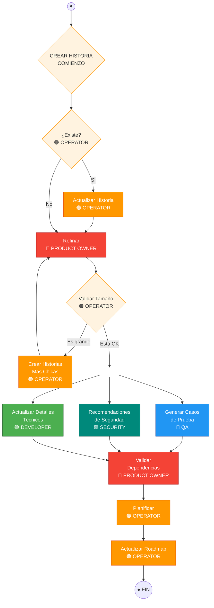

# Flujo Operativo: CREAR HISTORIA (To-Be)

> Diagrama digitalizado desde pizarra blanca (2026-03-13).
> Representa el flujo objetivo ("to be") del proceso de creación/refinamiento de historias de usuario.

## Roles

| Color (pizarra) | Rol | Skills/Agentes |
|------------------|-----|----------------|
| Naranja | **OPERATOR** | `/ops`, `/scrum`, `/planner`, `/refinar` |
| Verde | **DEVELOPER** | `/backend-dev`, `/android-dev`, `/guru` |
| Azul / Rojo (QA) | **QA** | `/qa`, `/tester` |
| Rojo | **PRODUCT OWNER** | `/po`, `/historia` |
| Verde (Security) | **SECURITY** | `/security` |

## Diagrama de flujo

## Detalle de cada paso

### 1. ¿Existe? — OPERATOR
- Verificar si ya hay un issue en GitHub para esta historia
- Buscar por título, labels o contenido similar en el backlog
- **Agente**: `/doc` (busca issues existentes)

### 2a. Actualizar Historia — OPERATOR (si ya existe)
- Actualizar el issue existente con nueva información
- Preservar historial de cambios y comentarios
- **Agente**: `/refinar`

### 2b. Refinar — PRODUCT OWNER (si no existe, o después de actualizar)
- Definir criterios de aceptación claros
- Especificar flujos principales y alternativos
- Detallar el valor de negocio y el usuario objetivo
- **Agente**: `/po` + `/historia`

### 3. Validar Tamaño — OPERATOR
- Evaluar si la historia es demasiado grande para un sprint
- Criterios: complejidad técnica, número de componentes afectados, esfuerzo estimado
- **Gate**: si es grande → partir en historias más chicas
- **Agente**: `/planner`

### 4. Crear Historias Más Chicas — OPERATOR (si es grande)
- Descomponer la historia en sub-historias independientes y entregables
- Cada sub-historia debe tener valor por sí misma
- Vuelve a Refinar para cada sub-historia
- **Agentes**: `/planner` + `/historia`

### 5. Trabajo paralelo (cuando el tamaño está OK)

Tres actividades se ejecutan **en paralelo**:

#### 5a. Generar Casos de Prueba — QA
- Crear casos de prueba E2E a partir de los criterios de aceptación
- Incluir casos positivos, negativos y de borde
- Formato del reporte PO+QA
- **Agente**: `/qa` + `/tester`

#### 5b. Recomendaciones de Seguridad — SECURITY
- Analizar la historia desde perspectiva OWASP
- Identificar vectores de ataque potenciales
- Recomendar controles y validaciones
- **Agente**: `/security`

#### 5c. Actualizar Detalles Técnicos — DEVELOPER
- Definir módulos y archivos afectados
- Identificar dependencias técnicas
- Proponer enfoque de implementación
- **Agente**: `/guru` + developer skill correspondiente

### 6. Validar Dependencias — PRODUCT OWNER
- Cruzar los resultados de QA, Security y Developer
- Verificar que no hay dependencias bloqueantes
- Confirmar que la historia está lista para desarrollo ("Definition of Ready")
- **Agente**: `/po`

### 7. Planificar — OPERATOR
- Asignar la historia al backlog correcto (Técnico, Cliente, Negocio, Delivery)
- Priorizar según impacto y esfuerzo
- **Agentes**: `/planner` + `/priorizar`

### 8. Actualizar Roadmap — OPERATOR
- Reflejar la nueva historia en `scripts/roadmap.json`
- Actualizar el Project V2 en GitHub
- **Agentes**: `/scrum` + `/planner`

## Gates y loops

| Gate | Evaluador | Criterio | Si falla |
|------|-----------|----------|----------|
| Existencia | Operator | ¿Ya existe un issue similar? | Actualizar en vez de duplicar |
| Tamaño | Operator | ¿Cabe en un sprint? | Partir en historias más chicas → re-refinar |
| Dependencias | Product Owner | ¿Está lista para desarrollo? | Resolver dependencias antes de planificar |

## Mapeo a skills del proyecto

| Paso | Skill principal | Skills de soporte |
|------|----------------|-------------------|
| Verificar existencia | `/doc` | — |
| Actualizar historia | `/refinar` | — |
| Refinar | `/po` | `/historia` |
| Validar tamaño | `/planner` | — |
| Partir historias | `/historia` | `/planner` |
| Generar casos prueba | `/qa` | `/tester` |
| Recomendaciones seguridad | `/security` | — |
| Detalles técnicos | `/guru` | developer skills |
| Validar dependencias | `/po` | — |
| Planificar | `/planner` | `/priorizar` |
| Actualizar roadmap | `/scrum` | `/planner` |
