# Flujo Operativo: LANZAR SPRINT (To-Be)

> Diagrama digitalizado desde pizarra blanca (2026-03-13).
> Representa el flujo objetivo ("to be") del proceso de sprint con agentes IA.

## Roles

| Color (pizarra) | Rol | Skills/Agentes |
|------------------|-----|----------------|
| Naranja | **OPERATOR** | `/ops`, `/scrum`, `/planner` |
| Verde | **DEVELOPER** | `/backend-dev`, `/android-dev`, `/ios-dev`, `/web-dev`, `/desktop-dev` |
| Azul | **QA** | `/qa`, `/tester`, `/review` |
| Rojo | **PRODUCT OWNER** | `/po`, `/doc nueva` |

## Diagrama de flujo

```mermaid
flowchart TD
    START((●)) --> LANZAR{LANZAR SPRINT}

    %% ── OPERATOR: Inicio ──
    LANZAR --> SYNC["Sincronizar Sprint Actual\ny Roadmap\n🟠 OPERATOR"]
    SYNC --> AGENTES["Lanzar Agentes\n🟠 OPERATOR"]

    %% ── DEVELOPER + QA: TDD ──
    AGENTES --> TDD["Generar Pruebas Unitarias\ncon TDD\n🟢 DEVELOPER"]
    TDD --> VALIDAR_TDD["Validar Calidad\nPruebas Unitarias\n🔵 QA"]

    VALIDAR_TDD -->|Mala calidad| TDD
    VALIDAR_TDD -->|Buena calidad| DEV

    %% ── DEVELOPER: Desarrollo ──
    DEV["Desarrollar\n🟢 DEVELOPER"]
    DEV -->|"Con errores\n/ valores incorrectos"| DEV

    %% ── QA: Validación de código ──
    DEV -->|Buena calidad| VALIDAR_CODE["Validar Calidad\nde Código\n🔵 QA"]
    VALIDAR_CODE -->|Mala calidad| DEV

    %% ── Ejecución de pruebas ──
    VALIDAR_CODE -->|Buena calidad| EXEC_UNIT["Ejecutar Pruebas\nUnitarias\n🟢 DEVELOPER"]
    EXEC_UNIT --> EXEC_QA["Ejecutar Casos\nde Prueba QA\n🔵 QA"]
    EXEC_QA --> VIDEOS["Generar Videos\nEvidencia\n🔵 QA"]

    %% ── PRODUCT OWNER: Revisión ──
    VIDEOS --> REVISAR["Revisar Videos\n🔴 PRODUCT OWNER"]
    REVISAR --> PROPONER["Proponer Nuevas\nHistorias\n🔴 PRODUCT OWNER"]

    %% ── OPERATOR: Cierre ──
    PROPONER --> PLANIFICAR["Planificar\n🟠 OPERATOR"]
    PLANIFICAR --> ROADMAP["Actualizar Roadmap\n🟠 OPERATOR"]
    ROADMAP --> FIN((● FIN))

    %% ── Estilos ──
    classDef operator fill:#ff9800,stroke:#e65100,color:#fff
    classDef developer fill:#4caf50,stroke:#1b5e20,color:#fff
    classDef qa fill:#2196f3,stroke:#0d47a1,color:#fff
    classDef po fill:#f44336,stroke:#b71c1c,color:#fff
    classDef decision fill:#fff3e0,stroke:#ff9800,color:#333

    class SYNC,AGENTES,PLANIFICAR,ROADMAP operator
    class TDD,DEV,EXEC_UNIT developer
    class VALIDAR_TDD,VALIDAR_CODE,EXEC_QA,VIDEOS qa
    class REVISAR,PROPONER po
    class LANZAR decision
```

## Detalle de cada paso

### 1. Sincronizar Sprint Actual y Roadmap — OPERATOR
- Revisar `scripts/roadmap.json` y el Project V2 de GitHub
- Identificar issues pendientes del sprint anterior
- Actualizar estados y prioridades
- **Agentes**: `/scrum` (auditoría de board) + `/planner` (sync roadmap)

### 2. Lanzar Agentes — OPERATOR
- Activar agentes de desarrollo según las historias priorizadas
- Máximo 3 agentes simultáneos (controlado por `agent-concurrency-check.js`)
- Cada agente toma un issue y crea rama `agent/<issue>-<slug>`
- **Agentes**: `/ops` (health-check) + skills de desarrollo

### 3. Generar Pruebas Unitarias con TDD — DEVELOPER
- Antes de implementar, generar tests que definan el comportamiento esperado
- Tests con nombres descriptivos en español (backtick)
- Framework: kotlin-test + MockK + runTest
- **Agente**: `/tester` (generación de tests)

### 4. Validar Calidad Pruebas Unitarias — QA
- Revisar cobertura, casos borde, nombres descriptivos
- Verificar que los tests fallen antes de implementar (red phase de TDD)
- **Gate**: si la calidad es mala → vuelve a paso 3
- **Agente**: `/qa` + `/review`

### 5. Desarrollar — DEVELOPER
- Implementar el código que hace pasar los tests
- Seguir patrones de arquitectura (Do/Comm/Client, ViewModels, etc.)
- Loop iterativo: corregir errores y valores hasta que pase
- **Agentes**: `/backend-dev`, `/android-dev`, `/ios-dev`, `/web-dev`, `/desktop-dev`

### 6. Validar Calidad de Código — QA
- Code review automatizado del PR
- Verificar patrones obligatorios (strings, logging, error handling)
- **Gate**: si la calidad es mala → vuelve a paso 5
- **Agente**: `/review`

### 7. Ejecutar Pruebas Unitarias — DEVELOPER
- `./gradlew check` — todos los tests deben pasar
- Verificar que no se saltaron tests
- **Agente**: `/tester` + `/builder`

### 8. Ejecutar Casos de Prueba QA — QA
- Tests E2E contra entorno real
- Ejecutar los casos de prueba del reporte PO+QA
- **Agente**: `/qa`

### 9. Generar Videos Evidencia — QA
- Screenrecord de cada flujo E2E
- Evidencia obligatoria antes de cerrar cualquier tarea
- **Agente**: `/qa` (con screenrecord integrado)

### 10. Revisar Videos — PRODUCT OWNER
- Validar que la funcionalidad cumple criterios de aceptación
- Aprobar o rechazar con feedback específico
- **Agente**: `/po`

### 11. Proponer Nuevas Historias — PRODUCT OWNER
- A partir de lo revisado, identificar mejoras o nuevas funcionalidades
- Crear issues con estructura completa
- **Agentes**: `/po` + `/doc nueva`

### 12. Planificar — OPERATOR
- Priorizar las nuevas historias propuestas
- Asignar al backlog correspondiente (Técnico, Cliente, Negocio, Delivery)
- **Agentes**: `/planner` + `/doc priorizar`

### 13. Actualizar Roadmap — OPERATOR
- Actualizar `scripts/roadmap.json` con el nuevo estado
- Cerrar el sprint actual en el board
- **Agentes**: `/scrum` + `/planner`

## Gates de calidad (loops)

El flujo tiene **3 gates de calidad** que generan loops de retrabajo:

| Gate | Evaluador | Criterio | Si falla | Automatización |
|------|-----------|----------|----------|----------------|
| Calidad de tests | QA | Tests cubren casos borde, nombres claros, red phase funciona | Volver a generar tests | `/delivery` re-invoca el developer skill automáticamente (máx 2 reintentos) |
| Calidad de código | QA | Patrones correctos, sin vulnerabilidades, strings OK | Volver a desarrollar | `/delivery` re-invoca el developer skill automáticamente (máx 2 reintentos) |
| Aceptación PO | Product Owner | Funcionalidad cumple criterios de aceptación | Proponer correcciones como nuevas historias | Manual — el PO crea nuevas historias en el backlog |

### Re-invocación automática de gates (implementada en `/delivery`)

El skill `/delivery` orquesta los loops de calidad en el **Paso 3.6**:

1. **Gate Review** (`/review`): si rechaza → re-invoca el developer skill con el feedback → re-corre `/review`. Máximo 2 reintentos.
2. **Gate Tester** (`/tester`): si rechaza → re-invoca el developer skill con los fallos → re-corre `/tester`. Máximo 2 reintentos.
3. Si después de 2 reintentos el gate sigue fallando → **escalar al usuario** y detener el delivery.

El developer skill a re-invocar se detecta automáticamente del activity log (último developer skill usado) o puede pasarse explícitamente con `--dev-skill <nombre>` al invocar `/delivery`.

## Mapeo a skills del proyecto

| Paso | Skill principal | Skills de soporte |
|------|----------------|-------------------|
| Sincronizar Sprint | `/scrum` | `/planner` |
| Lanzar Agentes | `/ops` | hooks de concurrencia |
| Generar Tests TDD | `/tester` | — |
| Validar Tests | `/qa` | `/review` |
| Desarrollar | `/backend-dev` y otros | `/guru` |
| Validar Código | `/review` | `/security` |
| Ejecutar Tests | `/tester` | `/builder` |
| Ejecutar QA E2E | `/qa` | — |
| Generar Videos | `/qa` | — |
| Revisar Videos | `/po` | — |
| Proponer Historias | `/doc nueva` | `/po` |
| Planificar | `/planner` | `/doc priorizar` |
| Actualizar Roadmap | `/scrum` | `/planner` |
