# Pipeline Activo de Agentes — Intrale Platform

> Creado: 2026-03-07 | Issue: #1237 | Estado: activo

## Objetivo

Transformar los agentes del proyecto de herramientas reactivas invocadas manualmente a participantes automáticos del ciclo de vida de cada historia, mejorando la calidad del producto sin intervención humana en cada paso.

---

## Diagrama del Pipeline

```mermaid
flowchart TD
    START([Inicio de historia]) --> BRANCH[/branch N slug/]
    BRANCH --> F1

    subgraph F1["FASE 1 — Inicio de historia"]
        PO1["/po acceptance #N<br/>Siempre — criterios de aceptación"]
        GURU1["/guru<br/>Si issue menciona libs/patrones nuevos"]
        UX1["/ux<br/>Si el issue toca archivos ui/"]
        SEC1["/security analyze #N<br/>Siempre — superficie de ataque"]
    end

    F1 --> DEV

    subgraph DEV["FASE 2 — Durante desarrollo (hooks PostToolUse)"]
        BUILDER2["/builder<br/>Si cambia build.gradle* o dependencias"]
        TESTER2["/tester<br/>Si se crea *Test.kt"]
        REVIEW2["/review<br/>Cada N archivos modificados"]
        SEC2["/security scan<br/>Si cambia auth/tokens/endpoints/config"]
    end

    DEV --> F3

    subgraph F3["FASE 3 — Gate pre-delivery (BLOQUEANTE)"]
        GATE_TESTER{"Tester<br/>Tests OK + cobertura"}
        GATE_PO{"PO<br/>Criterios de aceptacion"}
        GATE_SEC{"Security<br/>OWASP Top 10"}
        GATE_REVIEW{"Review<br/>Sin issues criticos"}
        GATE_QA{"QA (opcional)<br/>E2E si hay flows"}
    end

    F3 --> DECISION{Todos los gates<br/>pasan?}
    DECISION -- "No" --> FIX[Corregir problema]
    FIX --> F3
    DECISION -- "Si" --> DELIVERY[/delivery — crea PR/]
    DELIVERY --> MERGE[Merge a main]

    subgraph F4["FASE 4 — Post-merge"]
        SCRUM4["/scrum — actualizar board Project V2"]
        OPS4["/ops — health check post-merge"]
        SEC4["/security audit (semanal/sprint)"]
    end

    MERGE --> F4
    F4 --> DONE([Historia completada])

    style F1 fill:#e8f5e9,stroke:#388e3c
    style DEV fill:#e3f2fd,stroke:#1976d2
    style F3 fill:#fff3e0,stroke:#f57c00
    style F4 fill:#f3e5f5,stroke:#7b1fa2
    style DECISION fill:#ffecb3,stroke:#ffa000
    style FIX fill:#ffcdd2,stroke:#c62828
```



---

## Fases del Pipeline

### FASE 1 — Inicio de historia

**Trigger**: Post `/branch` o inicio del prompt del agente developer
**Naturaleza**: Preventiva — establecer contexto antes de codear

| Agente | Trigger | Output | Activación |
|--------|---------|--------|------------|
| `/po` | Siempre | Criterios de aceptación del issue, validación de scope | Automática via prompt |
| `/guru` | Issue menciona libs/patrones/frameworks nuevos | Investigación técnica, ejemplos, links | Automática via prompt (condicional) |
| `/ux` | Issue toca archivos `ui/` | Análisis de pantallas afectadas, sugerencias | Automática via prompt (condicional) |
| `/security` | Siempre | Análisis de superficie de ataque del cambio propuesto | Automática via prompt |

### FASE 2 — Durante desarrollo

**Trigger**: Hooks `PostToolUse[Edit,Write]` (no implementado en MVP — documentado para futuro)
**Naturaleza**: Reactiva — detectar problemas mientras se trabaja

| Agente | Trigger | Output | Activación |
|--------|---------|--------|------------|
| `/builder` | Cambios en `build.gradle*` o nuevas dependencias | Validación de compilación | Manual o hook futuro |
| `/tester` | Creación de archivos `*Test.kt` | Verificación de estructura, sugerencias de casos | Manual o hook futuro |
| `/review` | Cada N archivos modificados (configurable) | Review incremental | Manual o hook futuro |
| `/security` | Cambios en auth, tokens, permisos, endpoints, config | Alerta de vulnerabilidad | Manual o hook futuro |

### FASE 3 — Gate pre-delivery

**Trigger**: Invocación de `/delivery` → detección de `gh pr create` en `delivery-gate.js`
**Naturaleza**: Bloqueante — el PR no se crea hasta que todos los gates pasen

| Agente | Gate | Criterio de paso | Timeout |
|--------|------|-----------------|---------|
| `/tester` | Obligatorio | Tests pasan, cobertura >= umbral mínimo | 120s |
| `/po` | Obligatorio | Criterios de aceptación del issue verificados | 60s |
| `/security` | Obligatorio | Sin vulnerabilidades OWASP Top 10 en el diff | 90s |
| `/review` | Obligatorio | Sin issues críticos en el diff | 60s |
| `/qa` | Condicional | E2E tests pasan (si hay flows Maestro disponibles) | 300s |

Si cualquier gate falla, `delivery-gate.js` retorna exit code 1 y `gh pr create` no se ejecuta.

### FASE 4 — Post-merge

**Trigger**: Hook post-merge (no implementado en MVP — documentado para futuro)
**Naturaleza**: Consolidación — actualizar estado y auditar entorno

| Agente | Acción | Trigger |
|--------|--------|---------|
| `/scrum` | Actualizar board Project V2, métricas del sprint | Post-merge automático |
| `/ops` | Health check del entorno post-merge | Post-merge automático |
| `/security` | Auditoría periódica completa (semanal/por sprint) | Cron semanal |

---

## Auditoría Completa de Agentes

Para cada agente: fase(s) de intervención, trigger, output, veredicto.

| Agente | Fases | Trigger | Output | Veredicto |
|--------|-------|---------|--------|-----------|
| `/po` | 1, 3 | Inicio de historia (prompt); gate pre-delivery | Criterios de aceptación, validación de scope, veredicto APROBADO/REQUIERE CAMBIOS | **Indispensable** |
| `/guru` | 1 | Si issue menciona libs/patrones/frameworks nuevos | Investigación técnica, ejemplos, docs relevantes | **Indispensable** |
| `/ux` | 1 | Si issue toca archivos `ui/` | Análisis de pantallas, sugerencias de mejora | **Indispensable** |
| `/security` | 1, 2, 3, 4 | Siempre en F1/F3; cambios sensibles en F2; cron en F4 | Análisis de superficie de ataque, alertas OWASP, reporte periódico | **Indispensable** |
| `/tester` | 2, 3 | Creación de `*Test.kt` (F2); gate pre-delivery (F3) | Verificación de cobertura, sugerencias de casos de test | **Indispensable** |
| `/review` | 2, 3 | Cada N archivos modificados (F2); gate pre-delivery (F3) | Review incremental, sugerencias de mejora, veredicto | **Indispensable** |
| `/builder` | 2 | Cambios en `build.gradle*` o nuevas dependencias | Validación de compilación, alerta si rompe el build | **Indispensable** |
| `/qa` | 3 | Si hay flows Maestro disponibles (gate opcional) | E2E tests pasan/fallan, reporte de calidad | **Indispensable** |
| `/scrum` | 4 | Post-merge | Actualización de board Project V2, métricas del sprint | **Indispensable** |
| `/ops` | 4 | Post-merge; invocación manual | Health check del entorno, auto-reparación de worktrees | **Indispensable** |
| `/branch` | Pre-F1 | Creación de historia | Crear rama `agent/<issue>-<slug>`, protección de main | **Indispensable** |
| `/delivery` | Post-F3 | Fin de implementación | Commit + push + PR, merge | **Indispensable** |
| `/planner` | Pre-sprint | Inicio de sprint | Sprint plan, Gantt, sprint-plan.json para agentes | **Indispensable** |
| `/historia` | Ad-hoc | Creación de nueva historia | Issue GitHub con estructura completa | **Indispensable** |
| `/doc` | Ad-hoc | Nuevo issue o refinamiento | Historia de usuario completa, criterios de aceptación | **Fusionable** con `/historia` — ambos crean/refinan issues. Evaluar unificación. |
| `/refinar` | Ad-hoc | Triaje de issues sin labels | Etiquetar, organizar en backlogs, mover a Project V2 | **Fusionable** con `/priorizar` — ambos categorizan issues |
| `/priorizar` | Ad-hoc | Triaje masivo | Categorizar, etiquetar y organizar issues en backlogs | **Fusionable** con `/refinar` |
| `/auth` | Transversal | PostToolUse automático | Auto-persistir permisos aprobados en approval-history.json | **Indispensable** |
| `/monitor` | Ad-hoc | Invocación manual | Dashboard de semáforos multi-sesión, actividad en tiempo real | **Indispensable** |
| `/cleanup` | Ad-hoc | Fin de sprint o mantenimiento | Limpiar logs, sesiones, worktrees, procesos temporales | **Indispensable** |
| `/backend-dev` | F1-F3 | Issues con módulos `:backend`, `:users` | Implementación backend Ktor, microservicios, DynamoDB, Cognito | **Fusionable** — es un developer agent con contexto de backend. Evaluar si el prompt enrichment del agente genérico lo reemplaza. |
| `/android-dev` | F1-F3 | Issues con label `app:android` o archivos Android | Desarrollo Android con Compose, flavors, Coil, Material3 | **Fusionable** — developer agent con contexto Android. Misma evaluación que backend-dev. |
| `/ios-dev` | F1-F3 | Issues con label `app:ios` o archivos iOS | Desarrollo iOS con ComposeUIViewController | **Fusionable** — developer agent con contexto iOS. Activar solo si issue.labels incluye `app:ios`. |
| `/web-dev` | F1-F3 | Issues con label `app:web` o archivos Wasm | Desarrollo web con Kotlin/Wasm, PWA | **Fusionable** — developer agent con contexto web. Activar solo si issue.labels incluye `app:web`. |
| `/desktop-dev` | F1-F3 | Issues con label `app:desktop` o archivos JVM Desktop | Desarrollo Desktop JVM con Compose | **Fusionable** — developer agent con contexto desktop. Activar solo si issue.labels incluye `app:desktop`. |
| `/po` (ya listado) | 1, 3 | — | — | — |

### Resumen por veredicto

**Indispensables (17):** `/po`, `/guru`, `/ux`, `/security`, `/tester`, `/review`, `/builder`, `/qa`, `/scrum`, `/ops`, `/branch`, `/delivery`, `/planner`, `/historia`, `/auth`, `/monitor`, `/cleanup`

**Fusionables (6):** `/doc` + `/refinar` + `/priorizar` (posible unificación en un solo agente de triaje); `/backend-dev` + `/android-dev` + `/ios-dev` + `/web-dev` + `/desktop-dev` (evaluación: unificar como agente developer genérico con contexto de plataforma inyectado vía prompt enrichment del sprint-plan)

**Prescindibles (0):** Ningún agente es prescindible — todos tienen función diferenciada.

---

## Mecanismo de Orquestación (MVP)

### Opción A implementada: Gate en delivery-gate.js

**Archivo**: `.claude/hooks/delivery-gate.js`
**Hook tipo**: `PreToolUse[Bash]`
**Trigger**: Detecta comandos que comienzan con `gh pr create`

Flujo:
1. `delivery-gate.js` intercepta `gh pr create`
2. Lee el issue number del branch actual (`agent/<N>-slug`)
3. Ejecuta gates secuencialmente con timeout por agente
4. Si algún gate falla: exit code 1 → bloquea el PR
5. Si todos pasan: exit code 0 → permite continuar

### Opción B implementada: Prompt enrichment en /planner

El template de prompts en el skill `/planner` incluye instrucciones de invocar agentes en puntos específicos del ciclo de vida. Cada issue generado como `agente.prompt` en `sprint-plan.json` incluye:

```
Al iniciar: invocar /po para revisar criterios de aceptación del issue #N.
Si el issue toca UI (archivos ui/): invocar /ux para análisis de pantallas.
Si necesitás investigar algo nuevo (libs, patrones, frameworks): invocar /guru.
Antes de /delivery: invocar /tester para verificar tests.
Antes de /delivery: invocar /security para validar seguridad del diff.
```

---

## Consideraciones de Diseño

### Prevención de loops

Los agentes activados automáticamente (vía prompt o gate) NO disparan nuevamente el orquestador. La variable de entorno `PIPELINE_AGENT=1` puede usarse como guard si se implementa el orquestador Opción C en el futuro.

### Eficiencia de tokens

| Fase | Modelo recomendado | Justificación |
|------|--------------------|---------------|
| F1 — `/po`, `/ux` | `claude-sonnet-4-6` | Análisis de negocio/UX requiere razonamiento |
| F1 — `/guru` | `claude-sonnet-4-6` | Síntesis de documentación técnica |
| F1 — `/security` | `claude-sonnet-4-6` | Análisis de seguridad requiere razonamiento profundo |
| F3 — gates | `claude-haiku-4-5-20251001` | Verificaciones rápidas, eficientes en tokens |
| F4 — `/scrum`, `/ops` | `claude-haiku-4-5-20251001` | Acciones bien definidas, bajo razonamiento |

### Filtrado por plataforma

Los agentes de plataforma específica (`/android-dev`, `/ios-dev`, `/web-dev`, `/desktop-dev`) solo se activan si el issue incluye labels correspondientes:
- `app:android` → `/android-dev`
- `app:ios` → `/ios-dev`
- `app:web` → `/web-dev`
- `app:desktop` → `/desktop-dev`

Sin labels de plataforma específica: usar el developer agent genérico.

### Timeout por gate (Fase 3)

Gates que excedan el timeout se consideran **fallidos** (fail-closed) para seguridad:

```
/tester   → 120 segundos
/po       →  60 segundos
/security →  90 segundos
/review   →  60 segundos
/qa       → 300 segundos (E2E es lento)
```

---

## Estado de Implementación

| Entregable | Estado |
|-----------|--------|
| Este documento (`docs/pipeline-agentes.md`) | Completado |
| Agente `/security` (`.claude/skills/security/SKILL.md`) | Completado |
| Gate Fase 3 (`.claude/hooks/delivery-gate.js`) | Completado |
| Prompt enrichment en skill `/planner` | Completado |
| Fase 2 (hooks PostToolUse[Edit,Write]) | Documentado — implementación futura |
| Fase 4 post-merge automática | Documentado — implementación futura |
| Fusión de agentes developer | Evaluación futura |
