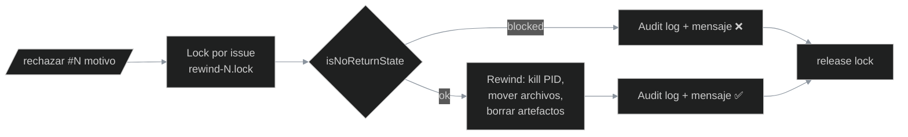

# Human-in-the-loop — Puntos de no retorno del pipeline

> Documento operativo del sistema de intervención humana del pipeline V3.
> Cubre la **guard de no retorno** que valida si un `/rechazar` puede
> ejecutarse o debe ser bloqueado.
>
> Issue origen: #3417 · Módulo: `.pipeline/lib/pipeline-states.js` ·
> Audit log: `.pipeline/audit/rejections-blocked.jsonl`

---

## Resumen ejecutivo

| Si el operador hace `/rechazar #N`...   | Y el issue está en...                | El resultado es                         |
|---|---|---|
|                                          | PR mergeado a main                    | ❌ Bloqueado — abrir issue de revert    |
|                                          | Cerrado manualmente                   | ❌ Bloqueado — reabrir en GH primero    |
|                                          | Label `wontfix` / `duplicate` / `invalid` | ❌ Bloqueado — sacar label primero  |
|                                          | Archivado por reconciler              | ❌ Bloqueado — sacarlo de `archivado/`  |
|                                          | GH API no responde                    | ⏳ Reintentar en unos segundos          |
|                                          | Cualquier otro estado                 | ✅ Procede al rewind                    |

El doc completo está abajo. Las primeras 10 líneas resuelven el 80% de los casos.

---

## Sección 1 — Puntos de no retorno

El pipeline V3 expone un comando `/rechazar #N <motivo>` que el operador
(Leo) puede usar desde Telegram para rebobinar un issue desde su fase
actual de vuelta a una fase anterior, reabriendo la posibilidad de cambios.
Pero hay **estados terminales** desde los cuales un rebobinado no
solamente es inútil sino destructivo. Esos estados están enumerados en
`NO_RETURN_STATES` (constante exportada por `lib/pipeline-states.js`).

| Estado / `reason`            | Por qué es no retorno                                                                                             | Qué hacer si igual lo necesitás                                                            |
|---|---|---|
| **`pr_merged`**              | El issue fue cerrado por un PR mergeado a `main`. El código ya está en producción. Rebobinar no des-mergea el PR. | Abrí un **issue nuevo de revert** referenciando el original. Es 2 minutos más y deja traza. |
| **`issue_closed`**           | El issue fue cerrado manualmente (Leo o un agente), sin merge. La decisión humana ya está documentada.            | **Reabrí el issue desde GitHub primero** (`gh issue reopen #N`) y volvé a tirar `/rechazar`. |
| **`label_wontfix`**          | El issue tiene la label `wontfix`. Es un estado terminal documental del backlog.                                  | Sacá la label desde GitHub (`gh issue edit #N --remove-label wontfix`) y volvé a tirar `/rechazar`. |
| **`label_duplicate`**        | El issue tiene la label `duplicate`. Apunta a otro issue donde se hace el trabajo.                                | Trabajá sobre el issue canónico, no sobre el duplicate.                                    |
| **`label_invalid`**          | El issue tiene la label `invalid`. No es accionable.                                                              | Si pensás que es válido, sacá la label desde GitHub y volvé a tirar `/rechazar`.           |
| **`archived`**               | El issue está en el directorio `archivado/` de alguna fase del pipeline. Movido por el reconciler.                | **Movelo manualmente fuera de `archivado/`** (a `pendiente/` de la fase correspondiente) y volvé a tirar `/rechazar`. |
| **`github_api_unavailable`** | La GH API no respondió a tiempo o devolvió error. **Fail-closed**: el pipeline NO rebobina ante ambigüedad.       | Esperá unos segundos y volvé a tirar `/rechazar`. Si persiste >5 min, verificá [GitHub Status](https://www.githubstatus.com/). |

### Fuente de verdad por reason (CA-4)

| Reason                       | ¿De dónde se decide?                                                                                                 |
|---|---|
| `pr_merged`                  | GH REST `gh issue view` + `pr-info-fetcher.js` (búsqueda por `head:agent/<N>-`).                                     |
| `issue_closed`               | GH REST `gh issue view` (`state: closed` sin PR mergeado asociado).                                                  |
| `label_*`                    | GH REST `gh issue view` (campo `labels`).                                                                            |
| `archived`                   | **Filesystem** `.pipeline/<pipeline>/<fase>/archivado/<N>.*` — único caso donde el filesystem es autoritativo (lo escribe el reconciler oficial). |
| `github_api_unavailable`     | Cualquier error / timeout / JSON malformado al consultar la GH API.                                                  |

**No consultamos** caches locales de labels, HEAD de worktrees, ni archivos
`.pipeline/desarrollo/aprobacion/procesado/<N>.delivery` para deducir el
estado. Pueden estar desincronizados con la realidad (reconciler atrasado,
worktree con HEAD viejo, limpieza manual durante triage).

---

## Sección 2 — Cómo funciona la guard



### Contrato del consumer (listener `pipeline.rejection`)

El listener vive en #3416. El módulo `lib/pipeline-states.js` solo expone
la **librería pura**; la integración la hace el listener siguiendo esta
secuencia (validate-first, act-second — SEC-NR-4 / CA-7):

1. **Adquirir lock por issue** (SEC-NR-2 / CA-5):

   ```js
   const lockFile = path.join('.pipeline/locks', `rewind-${issue}.lock`);
   const fd = fs.openSync(lockFile, 'wx'); // atomic O_EXCL
   fs.writeSync(fd, String(process.pid));
   ```

   - Si el lock existe y su PID está vivo → abortar con mensaje
     "rebobinado en curso, intentá en unos segundos".
   - Si el lock existe pero su PID ya no existe → es huérfano,
     romperlo (mismo patrón que `lib/handoff.js`).
   - **NO usar TTL absoluto**: rewinds legítimos pueden ser largos.

2. **Invocar la guard**:

   ```js
   const result = await isNoReturnState(issue);
   ```

3. **Si `result.blocked === true`**:

   - Persistir audit log: `appendBlockedRejection({ issue, blockedResult: result, ... })`.
   - Responder al operador con `formatBlockedMessage(result, issue)`.
   - **No mover un solo archivo. No matar un solo PID. No tocar labels.**
   - Liberar el lock y salir.

4. **Si `result.blocked === false`**:

   - Proceder con el rewind real (kill PID del agente, mover archivos
     `trabajando/` → `pendiente/` de la fase destino, borrar
     `.po/.ux/.plan/.dev/.qa` de fases posteriores, aplicar label
     a GH).
   - Liberar el lock cuando termine.

### Tests requeridos en el consumer

- Por cada uno de los 6 reasons de bloqueo (`pr_merged`, `issue_closed`,
  `label_wontfix`, `label_duplicate`, `label_invalid`, `archived`,
  `github_api_unavailable`): un test E2E que ejecute `/rechazar` y
  verifique que **ni un solo archivo se movió, ni un PID se mató, ni una
  label se aplicó**.
- Test de TOCTOU: dos `/rechazar` concurrentes sobre el mismo issue —
  uno debe ganar el lock, el otro debe ser rechazado.

---

## Sección 3 — Audit log

Cada bloqueo (y cada error en la guard) se persiste en
`.pipeline/audit/rejections-blocked.jsonl` usando el módulo
`lib/audit-log.js` (hash chain SHA-256, GENESIS, `verifyChain`).

### Formato de cada entry

```json
{
  "ts": "2026-05-20T15:30:00.123Z",
  "issue": 3381,
  "blocked_reason": "pr_merged",
  "reason_details": { "prNumber": 3402, "mergedAt": "2026-05-19T15:30:00Z" },
  "operator_chat_id_hash": "sha256:a3f5...",
  "raw_command_preview": "/rechazar 3381 mal mergeado",
  "lock_held_ms": 45,
  "created_at": 1716220200123,
  "hash_prev": "GENESIS",
  "hash_self": "8b2f..."
}
```

Campos clave:

| Campo                       | Tratamiento                                                                                                   |
|---|---|
| `operator_chat_id_hash`     | SHA-256 del chat_id de Telegram. **Nunca persiste en plano** (PII operativo).                                 |
| `raw_command_preview`       | Comando original del operador, pasado por `lib/redact.js` + redactor de pares `key=value`, truncado a 200 chars. |
| `reason_details`            | Solo primitivos (números/strings cortos). Sin paths absolutos. Backslashes normalizados a forward-slash para reproducibilidad cross-OS. |
| `hash_prev` / `hash_self`   | Encadenamiento SHA-256 sobre canonical JSON. Si alguien modifica una entry, `verifyChain` lo detecta.         |

### Verificar la integridad del chain

```bash
node -e "console.log(require('./.pipeline/lib/audit-log').verifyChain('.pipeline/audit/rejections-blocked.jsonl'))"
```

Salida esperada cuando está sano:

```js
{ ok: true, entriesChecked: 42 }
```

Si está roto:

```js
{ ok: false, entriesChecked: 17, brokenAt: 17, reason: "hash_prev mismatch: ..." }
```

### Lectura para análisis

```bash
node -e "console.table(require('./.pipeline/lib/audit-log').readAll('.pipeline/audit/rejections-blocked.jsonl').map(e => ({ts: e.ts, issue: e.issue, reason: e.blocked_reason})))"
```

---

## Sección 4 — Limitaciones conocidas (FAQ)

### ¿Por qué no existe `/rechazar --force`?

Porque el riesgo de cancelar un delivery ya en producción es asimétrico:
revertir un PR mergeado requiere flow externo (revert commit, redeploy),
NO un rewind del pipeline. Si lo necesitás, abrí un issue de revert
explícito — es 2 minutos más y deja trazabilidad.

### ¿Por qué no se reabren issues automáticamente?

Porque cerrar un issue es una decisión humana explícita (o un delivery).
Reabrirlo desde el pipeline para rebobinarlo confunde la fuente de verdad:
GitHub deja de ser autoritativo. Reabrilo manualmente (`gh issue reopen`)
y volvé a tirar `/rechazar` — el pipeline lo va a tomar.

### ¿Qué pasa si la GH API se cae?

**Fail-closed**. El pipeline NO rebobina sin confirmación de estado.
Reintentá en unos segundos; si persiste >5 min, revisá el [status de
GitHub](https://www.githubstatus.com/) y avisá por Telegram.

### ¿Por qué no detectamos PR mergeado sin `Closes #N`?

Default conservador (decisión PO en `criterios`). Detectarlo requiere
GraphQL con `timelineItems` o consultar la timeline REST, sumando
complejidad y latencia para un caso de borde. Si en el futuro aparece
incidencia real (operadores intentando rebobinar issues cuyo PR mergeado
no los cerró formalmente), se evalúa en issue separado.

### ¿Qué pasa si agregamos una fase nueva al pipeline?

El test `SEC-NR-7` (`pipeline-states.test.js`) parsea `config.yaml` y
verifica que cada fase declarada esté cubierta por `ARCHIVADO_PHASES`.
Si agregás una fase sin actualizar la constante, el test falla → el
PR no mergea hasta que cubras la fase nueva. Esto cierra el "silent
bypass" donde una fase terminal nueva podría dejar pasar archivados
sin detectar.

### ¿Cómo agrego un nuevo `reason` de no retorno?

1. Sumá el reason a `NO_RETURN_STATES` en `lib/pipeline-states.js`.
2. Sumá el template correspondiente a `BLOCKED_REASON_TO_USER_MSG` (sin
   variantes rotativas — los bloqueos deben ser deterministas).
3. Sumá la lógica de detección a `isNoReturnState`.
4. Agregá tests en `pipeline-states.test.js` cubriendo el nuevo reason.
5. Actualizá la tabla de la **Sección 1** de este doc.

---

## Referencias

- Issue origen: [#3417](https://github.com/intrale/platform/issues/3417)
- Issue del comando `/rechazar`: [#3415](https://github.com/intrale/platform/issues/3415)
- Issue del rebobinado: [#3416](https://github.com/intrale/platform/issues/3416)
- Módulo: `.pipeline/lib/pipeline-states.js`
- Tests: `.pipeline/lib/__tests__/pipeline-states.test.js`
- Audit log: `.pipeline/audit/rejections-blocked.jsonl`
- Building blocks: `lib/audit-log.js`, `lib/redact.js`, `lib/pr-info-fetcher.js`
