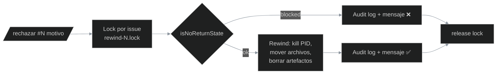

# Human-in-the-loop — Puntos de no retorno del pipeline

> Documento operativo del sistema de intervención humana del pipeline V3.
> Cubre la **guard de no retorno** que valida si un `/rechazar` puede
> ejecutarse o debe ser bloqueado.
>
> Issue origen: #3417 · Módulo: `.pipeline/lib/pipeline-states.js` ·
> Audit log: `.pipeline/audit/rejections-blocked.jsonl`

---

## Resumen ejecutivo

| Si el operador hace `/rechazar #N`...   | Y el issue está en...                | El resultado es                         |
|---|---|---|
|                                          | PR mergeado a main                    | ❌ Bloqueado — abrir issue de revert    |
|                                          | Cerrado manualmente                   | ❌ Bloqueado — reabrir en GH primero    |
|                                          | Label `wontfix` / `duplicate` / `invalid` | ❌ Bloqueado — sacar label primero  |
|                                          | Archivado por reconciler              | ❌ Bloqueado — sacarlo de `archivado/`  |
|                                          | GH API no responde                    | ⏳ Reintentar en unos segundos          |
|                                          | Cualquier otro estado                 | ✅ Procede al rewind                    |

El doc completo está abajo. Las primeras 10 líneas resuelven el 80% de los casos.

---

## Sección 1 — Puntos de no retorno

El pipeline V3 expone un comando `/rechazar #N <motivo>` que el operador
(Leo) puede usar desde Telegram para rebobinar un issue desde su fase
actual de vuelta a una fase anterior, reabriendo la posibilidad de cambios.
Pero hay **estados terminales** desde los cuales un rebobinado no
solamente es inútil sino destructivo. Esos estados están enumerados en
`NO_RETURN_STATES` (constante exportada por `lib/pipeline-states.js`).

| Estado / `reason`            | Por qué es no retorno                                                                                             | Qué hacer si igual lo necesitás                                                            |
|---|---|---|
| **`pr_merged`**              | El issue fue cerrado por un PR mergeado a `main`. El código ya está en producción. Rebobinar no des-mergea el PR. | Abrí un **issue nuevo de revert** referenciando el original. Es 2 minutos más y deja traza. |
| **`issue_closed`**           | El issue fue cerrado manualmente (Leo o un agente), sin merge. La decisión humana ya está documentada.            | **Reabrí el issue desde GitHub primero** (`gh issue reopen #N`) y volvé a tirar `/rechazar`. |
| **`label_wontfix`**          | El issue tiene la label `wontfix`. Es un estado terminal documental del backlog.                                  | Sacá la label desde GitHub (`gh issue edit #N --remove-label wontfix`) y volvé a tirar `/rechazar`. |
| **`label_duplicate`**        | El issue tiene la label `duplicate`. Apunta a otro issue donde se hace el trabajo.                                | Trabajá sobre el issue canónico, no sobre el duplicate.                                    |
| **`label_invalid`**          | El issue tiene la label `invalid`. No es accionable.                                                              | Si pensás que es válido, sacá la label desde GitHub y volvé a tirar `/rechazar`.           |
| **`archived`**               | El issue está en el directorio `archivado/` de alguna fase del pipeline. Movido por el reconciler.                | **Movelo manualmente fuera de `archivado/`** (a `pendiente/` de la fase correspondiente) y volvé a tirar `/rechazar`. |
| **`github_api_unavailable`** | La GH API no respondió a tiempo o devolvió error. **Fail-closed**: el pipeline NO rebobina ante ambigüedad.       | Esperá unos segundos y volvé a tirar `/rechazar`. Si persiste >5 min, verificá [GitHub Status](https://www.githubstatus.com/). |

### Fuente de verdad por reason (CA-4)

| Reason                       | ¿De dónde se decide?                                                                                                 |
|---|---|
| `pr_merged`                  | GH REST `gh issue view` + `pr-info-fetcher.js` (búsqueda por `head:agent/<N>-`).                                     |
| `issue_closed`               | GH REST `gh issue view` (`state: closed` sin PR mergeado asociado).                                                  |
| `label_*`                    | GH REST `gh issue view` (campo `labels`).                                                                            |
| `archived`                   | **Filesystem** `.pipeline/<pipeline>/<fase>/archivado/<N>.*` — único caso donde el filesystem es autoritativo (lo escribe el reconciler oficial). |
| `github_api_unavailable`     | Cualquier error / timeout / JSON malformado al consultar la GH API.                                                  |

**No consultamos** caches locales de labels, HEAD de worktrees, ni archivos
`.pipeline/desarrollo/aprobacion/procesado/<N>.delivery` para deducir el
estado. Pueden estar desincronizados con la realidad (reconciler atrasado,
worktree con HEAD viejo, limpieza manual durante triage).

---

## Sección 2 — Cómo funciona la guard


```mermaid
%%{init: {'theme':'dark', 'themeVariables': { 'primaryColor':'#0D274D', 'primaryTextColor':'#E6EDF3', 'primaryBorderColor':'#30363D', 'lineColor':'#8B949E'}}}%%
flowchart LR
    A[/rechazar #N motivo/] --> B[Lock por issue<br/>rewind-N.lock]
    B --> C{isNoReturnState}
    C -->|blocked| D[Audit log + mensaje ❌]
    C -->|ok| E[Rewind: kill PID,<br/>mover archivos,<br/>borrar artefactos]
    E --> F[Audit log + mensaje ✅]
    D --> G[release lock]
    F --> G
```

### Contrato del consumer (listener `pipeline.rejection`)

El listener vive en #3416. El módulo `lib/pipeline-states.js` solo expone
la **librería pura**; la integración la hace el listener siguiendo esta
secuencia (validate-first, act-second — SEC-NR-4 / CA-7):

1. **Adquirir lock por issue** (SEC-NR-2 / CA-5):

   ```js
   const lockFile = path.join('.pipeline/locks', `rewind-${issue}.lock`);
   const fd = fs.openSync(lockFile, 'wx'); // atomic O_EXCL
   fs.writeSync(fd, String(process.pid));
   ```

   - Si el lock existe y su PID está vivo → abortar con mensaje
     "rebobinado en curso, intentá en unos segundos".
   - Si el lock existe pero su PID ya no existe → es huérfano,
     romperlo (mismo patrón que `lib/handoff.js`).
   - **NO usar TTL absoluto**: rewinds legítimos pueden ser largos.

2. **Invocar la guard**:

   ```js
   const result = await isNoReturnState(issue);
   ```

3. **Si `result.blocked === true`**:

   - Persistir audit log: `appendBlockedRejection({ issue, blockedResult: result, ... })`.
   - Responder al operador con `formatBlockedMessage(result, issue)`.
   - **No mover un solo archivo. No matar un solo PID. No tocar labels.**
   - Liberar el lock y salir.

4. **Si `result.blocked === false`**:

   - Proceder con el rewind real (kill PID del agente, mover archivos
     `trabajando/` → `pendiente/` de la fase destino, borrar
     `.po/.ux/.plan/.dev/.qa` de fases posteriores, aplicar label
     a GH).
   - Liberar el lock cuando termine.

### Tests requeridos en el consumer

- Por cada uno de los 6 reasons de bloqueo (`pr_merged`, `issue_closed`,
  `label_wontfix`, `label_duplicate`, `label_invalid`, `archived`,
  `github_api_unavailable`): un test E2E que ejecute `/rechazar` y
  verifique que **ni un solo archivo se movió, ni un PID se mató, ni una
  label se aplicó**.
- Test de TOCTOU: dos `/rechazar` concurrentes sobre el mismo issue —
  uno debe ganar el lock, el otro debe ser rechazado.

---

## Sección 3 — Audit log

Cada bloqueo (y cada error en la guard) se persiste en
`.pipeline/audit/rejections-blocked.jsonl` usando el módulo
`lib/audit-log.js` (hash chain SHA-256, GENESIS, `verifyChain`).

### Formato de cada entry

```json
{
  "ts": "2026-05-20T15:30:00.123Z",
  "issue": 3381,
  "blocked_reason": "pr_merged",
  "reason_details": { "prNumber": 3402, "mergedAt": "2026-05-19T15:30:00Z" },
  "operator_chat_id_hash": "sha256:a3f5...",
  "raw_command_preview": "/rechazar 3381 mal mergeado",
  "lock_held_ms": 45,
  "created_at": 1716220200123,
  "hash_prev": "GENESIS",
  "hash_self": "8b2f..."
}
```

Campos clave:

| Campo                       | Tratamiento                                                                                                   |
|---|---|
| `operator_chat_id_hash`     | SHA-256 del chat_id de Telegram. **Nunca persiste en plano** (PII operativo).                                 |
| `raw_command_preview`       | Comando original del operador, pasado por `lib/redact.js` + redactor de pares `key=value`, truncado a 200 chars. |
| `reason_details`            | Solo primitivos (números/strings cortos). Sin paths absolutos. Backslashes normalizados a forward-slash para reproducibilidad cross-OS. |
| `hash_prev` / `hash_self`   | Encadenamiento SHA-256 sobre canonical JSON. Si alguien modifica una entry, `verifyChain` lo detecta.         |

### Verificar la integridad del chain

```bash
node -e "console.log(require('./.pipeline/lib/audit-log').verifyChain('.pipeline/audit/rejections-blocked.jsonl'))"
```

Salida esperada cuando está sano:

```js
{ ok: true, entriesChecked: 42 }
```

Si está roto:

```js
{ ok: false, entriesChecked: 17, brokenAt: 17, reason: "hash_prev mismatch: ..." }
```

### Lectura para análisis

```bash
node -e "console.table(require('./.pipeline/lib/audit-log').readAll('.pipeline/audit/rejections-blocked.jsonl').map(e => ({ts: e.ts, issue: e.issue, reason: e.blocked_reason})))"
```

---

## Sección 4 — Limitaciones conocidas (FAQ)

### ¿Por qué no existe `/rechazar --force`?

Porque el riesgo de cancelar un delivery ya en producción es asimétrico:
revertir un PR mergeado requiere flow externo (revert commit, redeploy),
NO un rewind del pipeline. Si lo necesitás, abrí un issue de revert
explícito — es 2 minutos más y deja trazabilidad.

### ¿Por qué no se reabren issues automáticamente?

Porque cerrar un issue es una decisión humana explícita (o un delivery).
Reabrirlo desde el pipeline para rebobinarlo confunde la fuente de verdad:
GitHub deja de ser autoritativo. Reabrilo manualmente (`gh issue reopen`)
y volvé a tirar `/rechazar` — el pipeline lo va a tomar.

### ¿Qué pasa si la GH API se cae?

**Fail-closed**. El pipeline NO rebobina sin confirmación de estado.
Reintentá en unos segundos; si persiste >5 min, revisá el [status de
GitHub](https://www.githubstatus.com/) y avisá por Telegram.

### ¿Por qué no detectamos PR mergeado sin `Closes #N`?

Default conservador (decisión PO en `criterios`). Detectarlo requiere
GraphQL con `timelineItems` o consultar la timeline REST, sumando
complejidad y latencia para un caso de borde. Si en el futuro aparece
incidencia real (operadores intentando rebobinar issues cuyo PR mergeado
no los cerró formalmente), se evalúa en issue separado.

### ¿Qué pasa si agregamos una fase nueva al pipeline?

El test `SEC-NR-7` (`pipeline-states.test.js`) parsea `config.yaml` y
verifica que cada fase declarada esté cubierta por `ARCHIVADO_PHASES`.
Si agregás una fase sin actualizar la constante, el test falla → el
PR no mergea hasta que cubras la fase nueva. Esto cierra el "silent
bypass" donde una fase terminal nueva podría dejar pasar archivados
sin detectar.

### ¿Cómo agrego un nuevo `reason` de no retorno?

1. Sumá el reason a `NO_RETURN_STATES` en `lib/pipeline-states.js`.
2. Sumá el template correspondiente a `BLOCKED_REASON_TO_USER_MSG` (sin
   variantes rotativas — los bloqueos deben ser deterministas).
3. Sumá la lógica de detección a `isNoReturnState`.
4. Agregá tests en `pipeline-states.test.js` cubriendo el nuevo reason.
5. Actualizá la tabla de la **Sección 1** de este doc.

---

## Sección 5 — Contrato de notificación proactiva (#5337)

> **Qué resuelve.** Hasta el 2026-08-01 el operador se enteraba de que el
> pipeline lo necesitaba **sólo si preguntaba**. Ese día hubo cuatro issues
> frenados (#5217, #5220, #5242, #5244), cada uno por una causa distinta, y no
> salió ni una notificación: se enteró horas después, al preguntar por el estado.
>
> El canal ya funcionaba (comentario en el issue → Telegram con botonera →
> audio TTS). Lo que faltaba era la **detección**: nada llegaba a
> `reportHumanBlock`. Esta sección documenta qué situación produce bloqueo
> humano, quién la emite, qué se le pide al operador y por qué canal.

### Tabla de triggers

| # | Situación | Quién la detecta | Qué se le pide al operador | Canal |
|---|---|---|---|---|
| 1 | **Hallazgos de seguridad** sin resolver que el ruleset de `main` exige | `detectSecurityFindingBlock` (`lib/human-block-triggers.js`) | Resolver los hallazgos o descartarlos como falso positivo | Telegram + botonera + audio |
| 2 | **Conflicto de merge** real contra la base (`mergeStateStatus: DIRTY`) | `detectMergeStateBlock` | Resolver a mano o devolver a desarrollo | Telegram + botonera + audio |
| 3 | **PO/UX/QA devuelven pidiendo una decisión** (no una corrección de código) | `detectDecisionRequestBlock` + `HUMAN_BLOCK_PATTERNS` | La decisión concreta que traba al agente | Telegram + botonera + audio |
| 4 | **Review manual exigida por CODEOWNERS / ruleset** (`BLOCKED` **con los checks verdes**) | `detectMergeStateBlock` | Revisar y aprobar el PR | Telegram + botonera + audio |
| 4b | **Check requerido en rojo** (`BLOCKED` con un check en `FAILURE`) | `detectMergeStateBlock` + `classifyChecks` | Devolver a desarrollo — **no** firmar | Telegram + botonera + audio |
| 5 | **Rebotado N veces por la misma causa** | `detectRepeatedRejectionBlock` | Cómo destrabar: el pipeline no converge solo | Telegram + botonera + audio |
| 6 | **Decisión de arquitectura no tomada** en definición | `detectDesignDecision` (`lib/design-decision-detect.js`) | Elegir entre las alternativas antes de que definición elija por default | Telegram + botonera |
| 7 | **Bloqueo sin responder** (cualquiera de los anteriores) | `runReminderTick` (`lib/human-block-reminder.js`) | Recordatorio agrupado y espaciado | Telegram (un mensaje por tick) |

> **`BLOCKED` no significa "sólo falta la review".** GitHub también lo devuelve
> cuando un check **requerido** está fallando o corriendo. Por eso el trigger 4
> se partió en dos: `classifyChecks` lee `statusCheckRollup` (que ya viajaba en
> el mismo `prInfo`, sin request extra) y recién entonces decide. Checks en rojo
> → trigger 4b, que le dice al operador que **no apruebe**; checks corriendo →
> `inconclusive`, se reevalúa en el barrido siguiente; checks verdes → trigger 4.
> Si el rollup no se puede leer, el mensaje **lo dice** en vez de afirmar que
> está todo en verde.

Dónde se emite cada uno en `pulpo.js`:

- **1, 2 y 4** — en el barrido, al cerrar el pipeline de `desarrollo`: el issue
  terminó pero su PR sigue abierto esperando algo. El estado del PR llega por
  `lib/pr-info-fetcher.js` (que ya se consultaba para el mensaje de cierre; se
  le sumaron `mergeable` y `mergeStateStatus`, **sin requests extra**) y las
  alertas por `lib/code-scanning-alerts.js`.
- **3 y 5** — en el barrido, en el camino de rebote, sobre los motivos de rechazo.
- **6** — en el intake de `definicion`, antes de que el issue entre a la fase.
- **7** — desde un cron propio, cada 30 min.

> **Un detector que nadie llama no existe.** Los detectores 1, 2 y 4 estuvieron
> escritos y con tests en verde pero **sin cablear** en `pulpo.js`: la suite
> pasaba y en producción no se notificaba nada — el mismo bug que #5337 vino a
> arreglar, disfrazado de test verde. Por eso hay tests que leen el fuente del
> pulpo y verifican el **cableado**, no sólo la lógica.

### Los tres veredictos posibles

Los detectores de estado de PR NO devuelven un booleano. Devuelven tres cosas
distintas, y la del medio es la que evita los dos modos de falla:

| Veredicto | Significado | Qué hace el pipeline |
|---|---|---|
| objeto con `trigger` | Bloqueo humano confirmado | Notifica y congela |
| `{ inconclusive: true }` | El dato todavía no está disponible | **Ni bloquea ni aprueba** — reintenta el barrido siguiente |
| `null` | Estado sano | Sigue el flujo normal |

**Por qué existe `inconclusive`:** GitHub calcula `mergeable` de forma
asíncrona y devuelve `UNKNOWN` mientras tanto. Tratarlo como conflicto genera
bloqueos espurios; tratarlo como limpio es fail-open. Un estado desconocido
nunca es un veredicto.

### Dos falsos positivos que el diseño evita a propósito

**Deuda preexistente de `main`.** La API de code-scanning devuelve todas las
alertas del repo, incluidas las `open` sobre `refs/heads/main`. Si el trigger no
filtrara por ref, **todo PR** quedaría bloqueado por deuda que no introdujo y el
pipeline se autobloquearía entero. Por eso una alerta sólo cuenta si está
instanciada en `refs/pull/<N>/head|merge` o en la rama del PR.

**Frenar issues sanos.** El trigger 6 (decisión de arquitectura) es el único que
clasifica texto libre, y el costo de su falso positivo es el **inverso exacto**
del problema que #5337 arregla: un issue sano parado esperando a un humano que
no tiene nada que decidir. De ahí que sea deliberadamente estrecho:

- Hay un **gate previo de marco decisorio** (`DECISION_FRAME_PATTERNS`): el issue
  tiene que *plantear* una decisión ("hay que definir dónde", "elegir entre",
  "opción A", "trade-off"). Sin eso no se evalúa ni una señal.
- Las señales están **enumeradas en el código**, en `DESIGN_DECISION_SIGNALS`, y
  en ningún otro lado.
- Cada señal exige **dos** coincidencias (el tema + un calificador) **en el mismo
  segmento y a menos de `PROXIMITY_WINDOW` caracteres**. "Rotar las credenciales
  de Telegram" menciona credenciales pero no plantea ninguna decisión; "dónde se
  almacenan las credenciales: ¿local o distribuido?" sí.
- El **código entre backticks se ignora**: un nombre de símbolo o un path no es
  prosa donde se plantee una decisión.
- Ante duda o señal no reconocida: **dejar pasar y registrar**, nunca frenar.

> **Por qué la proximidad no es un detalle.** La primera versión evaluaba el tema
> y el calificador sueltos sobre `title + body` concatenado. En bodies reales de
> 100+ líneas el calificador aparece siempre en *alguna* sección, así que el
> detector frenaba **18 de 50** issues del intake real de definición (36%) — y el
> falso positivo es terminal: como el query de intake filtra `-label:needs-human`,
> el issue frenado por error queda fuera del intake hasta destrabe manual. Con el
> gate + la ventana de proximidad + el descarte de código: **0 de 50**, sin perder
> el positivo real (#5217). Los 5 falsos positivos que lo destaparon (#5322,
> #5292, #5283, #4817, #5205) quedaron como fixtures de regresión en
> `human-block-notificacion.test.js`.

### Recordatorios: el silencio nunca aprueba

El aviso inicial vive dentro del gate `if (!yaBloqueado)` del barrido —dispara
sólo en la transición, para no repetir la misma alerta en cada tick—. Eso deja
un hueco: si el operador no vio ese único mensaje, el bloqueo queda mudo para
siempre. El cron de recordatorio lo cubre **sin relajar aquel gate**:

| Escalón | Cuándo |
|---|---|
| 1º | a las 2 h del bloqueo |
| 2º | a las 6 h |
| 3º | a las 24 h |
| siguientes | cada 72 h, indefinidamente |

- **Un solo mensaje agrupado** con todos los bloqueos vencidos, no uno por issue.
- Encabezado `🔁` y antigüedad por ítem, para distinguirlo del aviso inicial
  (`🚧`). Si fueran idénticos, el operador no sabría si mira un bloqueo nuevo o
  el mismo de hace seis horas.
- **Nunca auto-resuelve por vencimiento de plazo.** Es una garantía estructural,
  no una promesa: `human-block-reminder.js` no importa `unblockIssue`,
  `dismissBlockedIssue` ni `executeQuickAction`, y un test lo verifica sobre el
  código del módulo. Coherente con `gates-firma-operador.md`.
- Si el envío falla, el contador **no** avanza: el próximo tick reintenta en vez
  de dar por avisado algo que nunca salió.

### Bloqueos reales vs recomendaciones

El label `needs-human` se usa para dos cosas distintas, y mezclarlas mata la
señal. Medición del 2026-08-01:

```
needs-human total ................. 880
de esos tipo:recomendacion ........ 865
bloqueos reales ...................  15   (1,7%)
```

Un **bloqueo real** tiene un agente frenado atrás. Una **recomendación** de
`guru`/`security`/`po`/`ux`/`review` es backlog esperando triaje: nadie está
esperando al operador. Sólo los primeros notifican.

El discriminador es `lib/recommendation-labels.js` — **fuente única**, compartida
por `human-block.js`, `servicio-reconciler.js` y el dashboard. Una copia inline
del criterio sería una tercera fuente de verdad que se desincroniza.

Dos matices que el filtro respeta:

- Una recomendación con `recommendation:approved` **sí** cuenta: ya es trabajo
  real del pipeline.
- Un **marker en disco** nunca se filtra por labels. Lo creó `reportHumanBlock`,
  o sea que hubo un agente frenado de verdad; el filtro sólo aplica a las
  entradas que vienen únicamente de un label de GitHub.

### El intake consulta GitHub en DOS pases (#5689)

El intake (`pulpo.js`, `buildIntakeSearchQueries()`) no hace una consulta sino
dos, y une los resultados deduplicando por número:

| Pase | `--search` | Para qué |
|------|-----------|----------|
| **base** | `-label:needs-human -label:tipo:recomendacion` | Trabajo normal. Excluye bloqueo real (breaker de #2405) y el backlog de ~1.076 recomendaciones. |
| **rescate** | `-label:needs-human label:recommendation:approved` | Las recomendaciones que un humano **ya aprobó**. |

**Por qué dos y no una.** La búsqueda de GitHub no soporta `OR` ni paréntesis,
así que `-label:tipo:recomendacion` es incondicional: excluye también las recos
aprobadas, que conservan `tipo:recomendacion` (`approve()` agrega
`recommendation:approved`, no saca el otro). Con un solo pase, aprobar una
recomendación era un **no-op silencioso** — el gate de #2653 la habría admitido,
pero el issue ya nunca volvía de GitHub, así que el gate jamás la evaluaba. El
operador leía "entrará al pipeline en el próximo ciclo" y no entraba nunca.

Dos invariantes que no se pueden relajar:

- **El pase de rescate no es un bypass del breaker**: mantiene
  `-label:needs-human`, así que una reco aprobada que después se bloquea de
  verdad sigue afuera, igual que cualquier otro trabajo real.
- **Nada de esto es un control de seguridad.** Los dos pases sólo agregan
  *disponibilidad*; el índice de GitHub es eventualmente consistente. El control
  autoritativo sigue siendo el gate JS de `brazoIntake` sobre los labels frescos
  que la propia respuesta trajo (REQ-SEC-1).

### Cómo agrego un trigger nuevo

1. Sumá la entrada a `TRIGGERS` en `lib/human-block-triggers.js`.
2. Escribí el detector: **puro**, sin red ni filesystem, recibiendo el estado ya
   consultado. Nada bloqueante puede vivir ahí (corre dentro del barrido).
3. Devolvé `reason`, `question` y `recommendation`. La recomendación no es
   opcional-por-comodidad: sin ella el operador ve que algo está trabado pero no
   qué le conviene hacer.
4. Cableá el detector en el call-site (barrido o intake) dentro de un `try/catch`
   que deje pasar el flujo si falla.
5. Agregá tests en `human-block-notificacion.test.js`: uno que dispare y **uno
   que NO dispare** ante el caso sano parecido. El segundo es el que importa.
6. Sumá la fila a la tabla de esta sección.

### Kill-switch y configuración

```yaml
# config.yaml
human_block_reminder:
  enabled: true        # false → no se inicia el cron
  kill_switch: false   # true  → idem, para cortar en caliente
  tick_ms: 1800000     # 30 min por default
```

El estado vive en `.pipeline/human-block-reminder-state.json`, **gitignoreado**:
el repo principal hace `reset --hard` en cada respawn y un archivo versionado se
pisaría con el template vacío, reiniciando el escalado solo (es lo que ya pasó
con `waves.json`).

---

## Referencias

- Issue origen: [#3417](https://github.com/intrale/platform/issues/3417)
- Notificación proactiva: [#5337](https://github.com/intrale/platform/issues/5337)
- Módulos #5337: `lib/human-block-triggers.js`, `lib/design-decision-detect.js`,
  `lib/human-block-reminder.js`, `lib/recommendation-labels.js`,
  `lib/code-scanning-alerts.js`
- Tests #5337: `.pipeline/lib/__tests__/human-block-notificacion.test.js`,
  `.pipeline/lib/__tests__/code-scanning-alerts.test.js`
- Issue del comando `/rechazar`: [#3415](https://github.com/intrale/platform/issues/3415)
- Issue del rebobinado: [#3416](https://github.com/intrale/platform/issues/3416)
- Módulo: `.pipeline/lib/pipeline-states.js`
- Tests: `.pipeline/lib/__tests__/pipeline-states.test.js`
- Audit log: `.pipeline/audit/rejections-blocked.jsonl`
- Building blocks: `lib/audit-log.js`, `lib/redact.js`, `lib/pr-info-fetcher.js`
