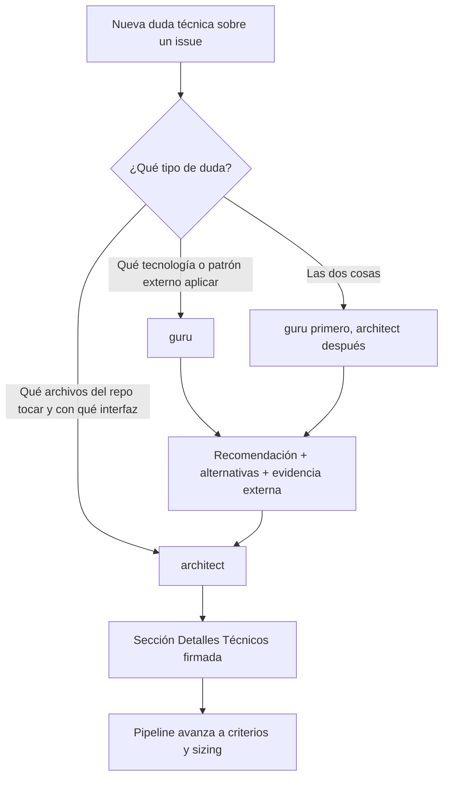

# Roles `guru` (Investigador) vs `architect` (Técnico) — Fronteras y Complementariedad

> **Audiencia:** operador del pipeline V3, agentes que ejecutan en él, humanos que abren issues nuevos.
> **Tipo:** documento de *boundaries* (este). El documento de *implementación* del rol `architect` (modelo, hooks, dashboard, audit) vive en [`docs/pipeline/architect-role.md`](./architect-role.md) (entregable de [#3507](https://github.com/intrale/platform/issues/3507), aún no mergeado al momento de redactar esto).
> **Issue de origen:** [#3542](https://github.com/intrale/platform/issues/3542).
> **Documentos complementarios:** [`docs/pipeline/spike-3526-architect-savings.md`](./spike-3526-architect-savings.md) (cuantificación retrospectiva), [`docs/pipeline/multi-provider.md`](./multi-provider.md) (orden de fallback por skill).

---

## TL;DR — qué resuelve cada rol (30 segundos)

- **`guru`** responde *"¿qué tecnología, patrón o implementación externa aplica acá?"*. Investigación + innovación, no determinístico.
- **`architect`** responde *"¿qué archivos del repo se tocan y con qué interfaz?"*. Firma técnica determinística + auditable.
- Si la duda combina ambas, **`guru` corre primero** y `architect` consume su recomendación para producir la sección "Detalles Técnicos".

---

## Mapa rápido

1. [Definición de cada rol](#1-definición-de-cada-rol)
2. [Tabla comparativa lado-a-lado](#2-tabla-comparativa-lado-a-lado)
3. [Árbol de decisión](#3-árbol-de-decisión)
4. [Entrada y salida por rol](#4-entrada-y-salida-por-rol)
5. [Fronteras y anti-patrones](#5-fronteras-y-anti-patrones)
6. [Ejemplos contrastados](#6-ejemplos-contrastados)
7. [Guía de decisión para agentes](#7-guía-de-decisión-para-agentes)
8. [Mapeo de entregas parciales (issue + Telegram)](#8-mapeo-de-entregas-parciales-issue--telegram)
9. [Orden de invocación en el pipeline](#9-orden-de-invocación-en-el-pipeline)
10. [Consideraciones de seguridad](#10-consideraciones-de-seguridad)
11. [FAQ](#11-faq)
12. [Cross-links](#12-cross-links)

---

## 1. Definición de cada rol

### 1.1 `guru` — Investigador / Innovador

Investigador técnico no determinístico. Su valor está en **mirar afuera del repo** y traer evidencia de patrones, librerías, implementaciones de otros proyectos o estado del arte que aplica al issue. La salida típica es una **recomendación con alternativas**, justificada por evidencia externa (links, benchmarks, RFCs, papers, otros repos).

- Cabe esperar variabilidad entre corridas: dos invocaciones del mismo issue pueden recomendar caminos diferentes si la evidencia externa cambió.
- No firma archivos exactos. Si menciona archivos del repo, es a nivel narrativo ("convendría tocar el módulo de waves") no contractual ("`backend/.../wave-resolver.js` línea 42").
- Herramientas típicas: Context7 MCP, `gh` (issues, PRs, otros repos vía `--repo`), fetch de docs externas, lectura amplia del codebase para entender el contexto pero no para firmarlo.

### 1.2 `architect` — Técnico / Firma de componentes

Técnico determinístico. Su valor está en **mirar adentro del repo** y producir la sección **"Detalles Técnicos"** del issue: qué archivos exactos se tocan, qué interfaces se modifican, qué riesgos hay, qué tests existen y qué tests faltan. La salida es una **firma técnica auditable**: dado el mismo issue y el mismo HEAD del repo, dos invocaciones de `architect` deberían producir secciones equivalentes (modulo redacción).

- No investiga afuera. Si necesita evidencia externa, **rechaza pidiendo input de `guru`** (cross-phase rebote) en lugar de inventar.
- Firma con audit JSONL (`section_hash` SHA-256 sobre el contenido escrito) para detectar tampering post-firma. El módulo de hooks de promoción (entregable de [#3507](https://github.com/intrale/platform/issues/3507)) usa este hash para validar consistencia entre el body del issue y el audit.
- Herramientas típicas: lectura focal del codebase (no exploratoria), `Grep`/`Read` sobre archivos candidatos, lectura de tests existentes para evaluar cobertura, lectura de `agents/*.md` para alinearse con convenciones del proyecto.

---

## 2. Tabla comparativa lado-a-lado

| Dimensión | `guru` (Investigador) | `architect` (Técnico) |
|-----------|------------------------|------------------------|
| Pregunta que resuelve | ¿Qué tecnología / patrón / implementación externa aplica? | ¿Qué archivos del repo se tocan y con qué interfaz? |
| Input típico | Pregunta abierta sobre tecnologías/patrones; issue sin contexto técnico cerrado. | Recomendación cerrada (puede venir de `guru`) o feature definida que ya supo qué stack usar. |
| Output típico | Recomendación + alternativas + evidencia externa (links, benchmarks). | Sección "Detalles Técnicos": archivos exactos, interfaces, impacto, riesgo, firma. |
| Mirada principal | Afuera del repo (otros proyectos, docs, papers). | Adentro del repo (código, tests, convenciones). |
| Herramientas | Context7 MCP, `gh --repo`, web fetches, lectura amplia del codebase. | `Grep`/`Read` focal, lectura de tests, lectura de convenciones (`agents/*`, `CLAUDE.md`). |
| Determinístico | No. Dos corridas pueden diferir según evidencia disponible. | Sí (modulo redacción). Dos corridas sobre el mismo HEAD deberían converger. |
| Firma audit JSONL | No (recomendación, no contrato). | Sí. `section_hash` SHA-256, persistido en `.pipeline/audit/*.jsonl`. |
| Bloquea promoción | No por sí mismo (la recomendación es opcional). | Sí, cuando la fase `analisis` valida presencia de firma `architect` (gate de #3507). |
| Modelo recomendado por default | Ver [`multi-provider.md`](./multi-provider.md) — Claude Opus en ola actual. | Sonnet 4.6 con fallback Haiku 4.5 (spike #3526). |

---

## 3. Árbol de decisión



> El árbol asume que `security` corre en paralelo a ambos (no aparece para no saturar el diagrama). Ver sección 9 para el orden completo de la fase `analisis`.

---

## 4. Entrada y salida por rol

### 4.1 `guru`

**Entrada:**
- Issue de GitHub con el cuerpo descrito por el humano (puede o no traer contexto técnico).
- Acceso a Context7 MCP, otros repos vía `gh --repo`, web.
- Stack del proyecto (CLAUDE.md) para chequear compatibilidad de la recomendación.

**Salida (un comentario al issue + headline a Telegram):**
- **Recomendación principal** con justificación.
- **Alternativas consideradas** (al menos 2 cuando aplica) con pros/contras breves.
- **Evidencia externa**: links a docs, repos, benchmarks, RFCs.
- **Compatibilidad con el stack actual** (Kotlin, Compose, Ktor, etc.).
- **Riesgos técnicos** identificados a alto nivel (no a nivel de archivo exacto).
- **NO** una sección "Detalles Técnicos" con archivos y líneas. Si lo hace, el reviewer humano o el hook de promoción lo rechaza por cruce de frontera (ver sección 5).

### 4.2 `architect`

**Entrada:**
- Issue de GitHub con (idealmente) recomendación cerrada de `guru` ya volcada como comentario.
- Acceso de lectura al repo (HEAD actual).
- Convenciones de proyecto: `CLAUDE.md`, `agents/*.md`, `.pipeline/roles/*.md`.

**Salida (un comentario al issue + headline a Telegram + entrada en audit JSONL):**
- **Archivos a tocar**: paths exactos relativos al root del repo.
- **Interfaces afectadas**: clases/funciones/endpoints cuyo contrato cambia.
- **Impacto**: módulos consumidores que requieren cambio o pueden romperse.
- **Tests existentes**: qué cubre y qué no cubre del cambio propuesto.
- **Tests a agregar**: qué falta para que el cambio sea seguro (kotlin-test + MockK, `node --test` para pipeline).
- **Riesgo**: 🟢 BAJO / 🟡 MEDIO / 🟠 ALTO / 🔴 CRÍTICO con justificación de 1-2 líneas.
- **Firma técnica**: línea final del comentario con `section_hash` SHA-256 del contenido firmado (entregable de #3507).
- **NO** evidencia externa, no comparativas con otros proyectos. Si necesita ese tipo de input, cross-phase rebote a `guru`.

---

## 5. Fronteras y anti-patrones

### Regla dura: ningún rol firma la sección del otro

| Pertenece a | Sección | Anti-patrón si lo escribe el otro |
|-------------|---------|-----------------------------------|
| `guru` | "Recomendación externa" / "Alternativas investigadas" / "Evidencia externa" | `architect` no la escribe. Si lo hace, el reviewer humano rechaza. |
| `architect` | "Detalles Técnicos" / "Archivos a tocar" / "Firma técnica + section_hash" | `guru` no la escribe. El incidente histórico #3502 es ejemplo (ver sección 6.1). |

### Anti-patrones concretos

1. **`guru` lista archivos del repo con línea exacta** (ej: *"modificar `backend/src/.../X.kt` línea 42 para que la función `foo()` reciba un nuevo parámetro"*). Esto es scope técnico de `architect`. La forma correcta para `guru` es narrativa: *"la migración requiere tocar el módulo de resolución de waves; los archivos exactos los firma `architect`"*.
2. **`architect` propone migrar a una librería sin evidencia externa** (ej: *"recomiendo usar `kotlinx-rpc 0.3.0` por sus features"*). Esto requiere research externo; es scope de `guru`. La forma correcta para `architect` es delegar: *"este issue requiere decisión de stack que `guru` no proveyó; rebote cross-phase a `guru`"*.
3. **Cualquiera de los dos firma con `section_hash` una sección que escribió el otro** — invalida el audit trail. El hash debe ser sobre contenido propio.
4. **`guru` o `architect` editan secciones de fases posteriores** (criterios, sizing, dev) en el body del issue. Esas secciones las llenan otros agentes en comentarios separados, no se tocan desde `analisis`.
5. **Mezclar ambas firmas en un solo comentario.** Cada rol publica un comentario independiente al issue con su sección clara y atribuida. Esto preserva la trazabilidad y permite que el hook de promoción los valide por separado.

---

## 6. Ejemplos contrastados

### 6.1 Caso real histórico — #3502 "migrar wave-resolver.js"

**Antes (cómo se ejecutó):** `guru` produjo un comentario que mezclaba research externo + scope técnico. Concretamente:

> *"✅ VIABLE — patrón en X, compatible con Compose 1.8.2. Migrar `wave-resolver.js` y `waves.js`, agregar interfaz `WaveResolver` con métodos `resolve()` y `cancel()`. Riesgo BAJO."*

El problema: `guru` mencionó **archivos exactos + interfaz + riesgo**, que es responsabilidad de `architect`. Esto fue posible porque el rol `architect` no existía aún. Cuando llegó la fase de implementación, el dev no tenía cómo saber si lo de `guru` era una *propuesta* (a refinar) o un *contrato* (a respetar). Resultado: ambigüedad y rework.

**Después (cómo se ejecutaría con la separación clara):**

`guru` (comentario 1):
> *"✅ VIABLE. Recomiendo migrar el resolver de waves usando el patrón observer-based que aplica Mozilla en su módulo de planning ([link](https://example/...)). Alternativa B: mantener polling actual con back-off exponencial (referencia: Spotify engineering blog [link](https://example/...)) — peor performance pero cero riesgo de regresión. Compatible con Compose 1.8.2 y el stack Node del pipeline. Los archivos exactos los firma `architect`."*

`architect` (comentario 2):
> *"Detalles Técnicos. Archivos a tocar: `.pipeline/wave-resolver.js` (refactor a interfaz `WaveResolver`), `.pipeline/waves.js` (consumer; cambiar import + uso). Interfaces afectadas: `WaveResolver.resolve()`, `WaveResolver.cancel()`. Impacto: ningún consumer externo (pipeline cerrado). Tests existentes: `.pipeline/tests/waves.test.js` cubre el happy path. Tests a agregar: cancelación in-flight, error de provider. Riesgo: 🟢 BAJO. section_hash: a1b2c3...d4e5"*

La diferencia: `guru` recomienda **qué patrón aplicar y por qué** con evidencia externa. `architect` firma **qué archivos del repo se tocan y con qué interfaz**, con audit trail.

### 6.2 Caso sintético — "agregar endpoint POST /business/{biz}/users/2fa-reset al backend"

Este es un ejemplo de issue donde `guru` **no interviene** (no hay decisión de stack externa — Ktor + Cognito ya están elegidos) y `architect` firma directamente.

`guru` (comentario opcional, podría no postear):
> *"Sin research externo necesario: el stack ya tiene Cognito + Ktor para casos análogos (ver implementación de `/signin`). No abro alternativas."*

`architect` (comentario obligatorio):
> *"Detalles Técnicos. Archivos a tocar: `users/src/main/kotlin/.../TwoFaReset.kt` (nuevo), `users/src/main/kotlin/.../Modules.kt` (registrar `bindSingleton<Function>(tag=\"2fa-reset\")`). Interfaces afectadas: nueva clase `TwoFaReset : SecuredFunction`. Impacto: ningún consumer del backend (endpoint nuevo); revisar permisos Cognito del usuario QA. Tests existentes: `SecuredFunctionTest` cubre el contrato base. Tests a agregar: caso happy path + caso usuario no autenticado + caso TOTP inválido. Riesgo: 🟡 MEDIO (toca flujo de autenticación). section_hash: f6e7d8...c9b0"*

**Lección:** no todo issue requiere `guru`. Cuando la decisión de stack ya está cerrada por el proyecto, `architect` firma directamente. La fase `analisis` corre `guru` igual (paralelo), pero `guru` puede entregar un comentario corto explicando "sin research necesario" — no es ruido, es trazabilidad.

---

## 7. Guía de decisión para agentes

### 7.1 Para un agente o humano con una duda técnica nueva

Aplicar el árbol binario:

1. ¿La duda es **qué tecnología, librería o patrón externo aplicar**? → invocar `guru`.
2. ¿La duda es **qué archivos del repo tocar y con qué interfaz exacta**? → invocar `architect`.
3. ¿Son **ambas**? → `guru` primero (no determinístico, abre opciones), `architect` después (cierra el contrato).

### 7.2 Para el dev (`backend-dev`, `android-dev`, `web-dev`, `pipeline-dev`) que recibe un issue en fase `dev`

- Si el comentario de `architect` falta en el issue → **rebote cross-phase** a `definicion/analisis/architect` (ver `_base.md` → "Rebote cross-phase"). No empezar a codear sin contrato.
- Si el comentario de `architect` existe pero discrepa con lo que ves al leer el código → rebote cross-phase con motivo + evidencia empírica (paths, líneas, output de `grep`). No corrijas el contrato vos: el flujo correcto es re-firmar.
- Si `guru` recomendó algo que en `dev` ves que no aplica (evidencia interna que `guru` no vio) → rebote cross-phase a `guru` con la nueva evidencia. `guru` re-recomienda; `architect` re-firma.

### 7.3 Para el reviewer humano

- Validar que `guru` solo escribió "recomendación + alternativas + evidencia externa", sin archivos exactos ni interfaces firmadas.
- Validar que `architect` solo escribió "archivos + interfaces + impacto + tests + riesgo + firma", sin investigar otros proyectos.
- Si ambos están bien atribuidos pero la decisión técnica es discutible → debate en el thread del issue antes de promover; no rechazar el rol del agente, rechazar la *decisión*.

---

## 8. Mapeo de entregas parciales (issue + Telegram)

### 8.1 Issue (comentario al body)

Cada rol publica **un comentario al issue, separado** (no edita el body del issue ni el comentario del otro rol). Formato:

```markdown
## 🔬 guru · #<issue>

<recomendación + alternativas + evidencia externa>

— guru agent
```

```markdown
## 🏛️ architect · #<issue>

### Detalles Técnicos

- **Archivos a tocar:** ...
- **Interfaces afectadas:** ...
- **Impacto:** ...
- **Tests existentes:** ...
- **Tests a agregar:** ...
- **Riesgo:** 🟢 BAJO / 🟡 MEDIO / 🟠 ALTO / 🔴 CRÍTICO — <justificación>

`section_hash: <SHA-256 sobre el contenido firmado>`

— architect agent
```

### 8.2 Telegram (headline corto)

Máximo 6 líneas visibles en preview. El detalle largo queda en el comentario al issue; Telegram solo muestra el headline.

```
🔬 *guru* · #<issue>
✅ Recomendación entregada
📚 Alternativas consideradas: <N>
🔗 [Ver análisis](url-al-comment)
```

```
🏛️ *architect* · #<issue>
✅ Firma técnica
📄 Archivos: <N> · Riesgo: 🟡 MEDIO
🔗 [Ver detalles](url-al-comment)
```

**No duplicar contenido entre los dos mensajes.** Si `guru` ya dijo "migrar a X", `architect` notifica *"Firmo migración a X: archivos A, B, C — riesgo BAJO"*, no repite el por qué.

**Sanitización obligatoria antes de Telegram:** no incluir paths absolutos del filesystem (`C:\Workspaces\...`), no incluir nombres de variables de entorno, redacción automática de tokens y API keys. Reutilizar el redactor del bot.

---

## 9. Orden de invocación en el pipeline

### 9.1 Orden recomendado en fase `definicion/analisis`

```
analisis: [guru, security, architect]
```

Los tres corren en **paralelo** porque son independientes:
- `guru` mira afuera del repo (research externo).
- `security` mira el threat model del issue (independiente de implementación).
- `architect` mira adentro del repo (codebase, interfaces, tests).

La salida combinada es lo que la fase `criterios` (po + ux) consume para refinar CAs.

### 9.2 Estado actual de `.pipeline/config.yaml`

> ⚠️ **Este documento define el orden propuesto; el archivo `.pipeline/config.yaml` NO se modifica en este issue.**

Al momento de redactar (2026-05-26), `config.yaml` tiene:

```yaml
definicion:
  fases: [analisis, criterios, sizing]
  skills_por_fase:
    analisis: [guru, security]
    criterios: [po, ux]
    sizing: [planner]
```

La mutación efectiva a `analisis: [guru, security, architect]` queda **diferida al issue [#3507](https://github.com/intrale/platform/issues/3507)**, cuando exista el skill `architect` registrado con su modelo, prompts y hooks de promoción. Cambiar `config.yaml` antes de tener el skill instanciado **rompe el boot del Pulpo**.

**Instrucción para el implementador de #3507:** sumar `architect` al array `analisis` solo cuando el skill esté operativo end-to-end (definición del rol en `.pipeline/roles/architect.md`, modelo configurado en `agent-models.json`, hooks de promoción validando firma).

### 9.3 Validación de no-regresión

Hasta que #3507 mergee, el pipeline sigue corriendo con `analisis: [guru, security]`. Issues abiertos antes del merge de este documento siguen siendo válidos y no requieren firma de `architect` para promoverse.

---

## 10. Consideraciones de seguridad

Esta sección incorpora los requisitos levantados por el agente `security` en la fase `analisis` del propio #3542 ([comment 4544695931](https://github.com/intrale/platform/issues/3542#issuecomment-4544695931)). El *cumplimiento operativo* de estos puntos es responsabilidad del entregable de [#3507](https://github.com/intrale/platform/issues/3507); acá solo se documentan como *guideline* para el implementador.

1. **Separation of duties como control implícito.** Delimitar `guru` (investigación) vs `architect` (firma técnica) reduce el riesgo de que un solo rol decida y ejecute. La sección 5 ("Fronteras y anti-patrones") es la guía operativa de este control.

2. **Audit JSONL con no-repudiation.** Cada firma de `architect` produce una entrada en `.pipeline/audit/*.jsonl` con `skill`, `issue`, `timestamp`, `section_hash` (SHA-256 del contenido firmado). El hash permite detectar tampering posterior: si alguien edita la sección, el hash deja de matchear. Implementación: entregable de #3507.

3. **Handoff cross-agente seguro.** Las secciones de `guru` y `architect` entran al handoff acumulado por issue vía [`.pipeline/lib/handoff.js`](../../.pipeline/lib/handoff.js) (#2993). Heredan automáticamente:
   - Redacción de secrets (AWS keys, JWT, API keys, passwords).
   - Detección de prompt-injection (`ignore previous`, `nuevas instrucciones`, etc.) con truncado + alerta.
   - Cap de 10KB por sección.
   - **No** escritura directa al archivo `.pipeline/handoff/<issue>.md` — siempre vía `handoff.appendSection(...)`.

4. **Hook de promoción `needs-definition` → `Ready`.** El validador del hook (entregable de #3507) debe chequear:
   - Presencia de comentario firmado por `architect` (no es opcional una vez activo).
   - Ausencia de patrones de prompt-injection en las secciones de `guru` y `architect`.
   - Firmas no vacías ni placeholders (`TODO`, `pending`, `...`).
   - `section_hash` del audit JSONL matchea con el contenido actual del comment del issue (detección de edición post-firma).

5. **Notificaciones Telegram.** Los headlines de `guru` y `architect` pasan por el redactor de secrets del bot. Evitar paths absolutos, env vars en mensajes, y cualquier dato sensible. Reutilizar la utilidad existente, no implementar redacción nueva.

6. **Issue template con secciones opcionales.** Las secciones in-line del template (`Recomendación Guru (opcional)`, `Detalles Técnicos (Architect) (opcional)`) son **leídas por los agentes** y por lo tanto entran al prompt del próximo agente. El validador del hook de promoción debe sanitizar/escapar antes de inyectar, como defensa contra prompt-injection desde texto editado por humanos en el body del issue.

---

## 11. FAQ

### ¿Y si `guru` escribió detalles técnicos sin querer?

El reviewer humano (o, una vez activo, el hook de promoción) detecta el cruce de frontera y rechaza con motivo `frontier_violation`. La corrección operativa: `guru` re-postea su comentario solo con recomendación + alternativas + evidencia externa, y `architect` toma su parte (archivos, interfaces) en un comentario separado. **No se edita el comentario viejo de `guru`** — se postea uno nuevo y se referencia que el anterior queda invalidado.

### ¿`architect` puede pedirle más research a `guru`?

Sí. Si `architect` empieza su análisis y descubre que no puede firmar sin una decisión de stack que falta (ej: "no sé si usar `kotlinx-rpc` o `Ktor SSE` para este endpoint"), el flujo correcto es **rebote cross-phase** a `guru` (ver `_base.md` → "Rebote cross-phase"). `architect` rechaza con `rebote_destino: { pipeline: definicion, fase: analisis, skill: guru }` + motivo explícito. `guru` re-investiga y produce una recomendación cerrada; cuando vuelve, `architect` firma.

### ¿Cómo resuelvo solapamiento histórico (issues pre-`architect`)?

Issues que ya pasaron `analisis` con solo `guru` (sin firma de `architect`) siguen siendo válidos. No hay que retro-firmarlos. Solo issues nuevos que entren a `analisis` después del merge de #3507 deben tener firma de `architect`. El gate de promoción no es retroactivo.

### ¿Qué pasa si `guru` y `architect` discrepan?

Ejemplo: `guru` recomienda usar librería X; `architect` ve que X no es compatible con un módulo crítico del repo. **La autoridad final es `architect`** porque su firma es el contrato técnico. Operativamente, `architect` posta su sección "Detalles Técnicos" donde **referencia la discrepancia y la justifica** ("la recomendación de `guru` sobre X no es viable porque el módulo Y depende de versión Z incompatible; firmo opción alternativa B con archivos C, D, E"). El reviewer humano puede pedir un re-análisis de `guru` con la nueva info, pero no es bloqueante por default.

### ¿`guru` puede omitir comentario si no hay research necesario?

Sí. Issues donde la decisión de stack ya está cerrada (típicamente CRUD sobre stack existente) no requieren research externo. `guru` puede postear un comentario corto: *"Sin research externo necesario, el stack ya cubre este caso. Cedo a `architect` la firma técnica."* — esto es **trazabilidad**, no ruido. Permite al lector saber que `guru` evaluó y no que olvidó correr.

### ¿Qué pasa si el issue no tiene `architect` activo en el pipeline?

Hasta que #3507 mergee, el pipeline corre con `analisis: [guru, security]` (sin `architect`). En ese período, `guru` puede *seguir* incluyendo scope técnico en sus comentarios (como hizo históricamente) **mientras el dev del área lo trate como propuesta, no como contrato**. Una vez #3507 mergea, las fronteras de este documento aplican estrictamente y el gate de promoción las hace cumplir.

---

## 12. Cross-links

- [`docs/pipeline/architect-role.md`](./architect-role.md) — implementación del rol `architect` (entregable de #3507).
- [`docs/pipeline/spike-3526-architect-savings.md`](./spike-3526-architect-savings.md) — cuantificación retrospectiva del ahorro proyectado del rol Arquitecto.
- [`docs/pipeline/multi-provider.md`](./multi-provider.md) — orden de fallback de proveedores por skill (incluye `guru` y `architect`).
- [`.pipeline/roles/guru.md`](../../.pipeline/roles/guru.md) — prompt de rol actual del agente `guru` (a actualizar cuando #3507 mergee para reflejar boundaries).
- [`.pipeline/lib/handoff.js`](../../.pipeline/lib/handoff.js) — handoff cross-agente (#2993), módulo que las secciones de `guru` y `architect` consumen.
- [#3507](https://github.com/intrale/platform/issues/3507) — Discovery: rol "Arquitecto" en fase de definición.
- [#3526](https://github.com/intrale/platform/issues/3526) — Spike retrospectivo de ahorro.
- [#3542](https://github.com/intrale/platform/issues/3542) — este issue (boundaries `guru` vs `architect`).
- [#2993](https://github.com/intrale/platform/issues/2993) — handoff cross-agente.
- [#3557](https://github.com/intrale/platform/issues/3557) — recomendación UX de dashboard timeline horizontal (no bloqueante).
